# Variant report 2023-07-26

This month's report provides an overview of the main XBB and non-XBB branches currently circulating, covering: XBB.1.5, XBB.1.9.1, XBB.1.9.2, XBB.1.16, XBB.1.22.1, XBB.2.3, XBB.1.18.1, XBB.1.17.1, XBB.1.42, XBB.1.19; as well as non-XBB lineages CH.1.1, BN.1, BA.2.3.20, XAY and XBC.

In addition to the branches themselves, this report also examines beneficial spike mutations occurring repeatedly in various XBB. The mutations discussed include S:478R, S:F456L, S:E554K, S:Q613H, S:S704L, S:A701V, S:K356T, and S:K403R.

## Main XBB branches

### XBB.1.5 (Nextstrain clade 23A, S:486P S:252V)

XBB.1.5 was the first XBB sublineage to acquire S:F486P and spread widely. It was most common in USA/Canada, where it peaked at around 80% in March 2023. The global unweighted average has decreased from a peak of ~55% in March to ~20% at the end of June.

Interesting sublineages:
- XBB.1.5.70 (Pango alias GK) with S:L455F, S:F456L, most common in Brazil, where it has grown to around 30%.

### XBB.1.9.1 (Pango alias FL, 486P 252V)

Shares ORF9b:I5T with XBB.1.9.2 and XBB.1.16, and ORF1a:G1819S + ORF1a:T4175I with XBB.1.9.2. Peaked globally at around ~15-20% in May/June. Historically most common in South East Asia (Indonesia/Malaysia). 

Interesting sublineages:
- FL.1.5.1 (Pango alias HN) with S:F456L, S:478R, S:A701V, most common in Dominican Republic where it appears to have become dominant. On the rise in US/Canada.

### XBB.1.9.2 (Pango alias EG, 486P 252V)

Shares ORF9b:I5T with XBB.1.9.2 and XBB.1.16, and ORF1a:G1819S + ORF1a:T4175I with XBB.1.9.2 (acquired 486P independently, but differs from XBB.1.9.1 otherwise only by synonymous mutations). Globally on the rise with 15-20% share at the end of June. Historically most common in Indonesia, currently most common in China (in particular sublineage EG.5.1).

Interesting sublineages:
- EG.5.1 with S:F456L, S:Q52H, ~30% share in China, ~10% globally at end of June

### XBB.1.16 (Nextstrain clade 23B, 478R 486P 180V 252V)

Shares ORF9b:I5T with XBB.1.9.1/XBB.1.9.2. Historically most common in India where it reached ~80% in April. First XBB lineage with both 486P and 478R to spread widely. Globally stable at around 20-25% at the end of June.

Interesting sublineages:
- XBB.1.16.6 with additional S:F456L (via T22930A), in the US already ~4% at end of June
- XBB.1.16.9 with additional S:F456L (via T22930G), most common in Singapore, at around 2% at end of June

### XBB.1.22.1 (Pango alias FY, 486P 200C 252V)

Shares ORF9b:I5T with XBB.1.9.1/XBB.1.9.2/XBB.1.16. Most common in Asia, particularly China, where it has grown to above 10% at the end of June.

Interesting sublineages:
- FY.4.1 (S:Y451H, S:494P), dominant in Kenya in March/April

### XBB.2.3 (486P 521S 253G)

Only common XBB sublineage that has 252V instead of 253G. Only main XBB lineage to have ORF1b:P959S reverted to Wuhan (mutation inherited from the BJ.1 parent, where it was the defining mutation of BA.2.10). Most common in India where it has been at around 20% since January. Globally on the rise with around 10% share at the end of June.

Interesting sublineages:
- XBB.2.3.8 with S:478R
- XBB.2.3.11 with S:478R
- GE.1 (XBB.2.3.10.1) with S:478R and S:185-, S:F186I due to 3nt cross-codon deletion

### XBB.1.18.1 (Pango alias FE, S:486P 252V)

Independently acquired 486P after ORF1a:D2579G. Most common in Brazil where it reached >50% share in May. Globally just below 2% at the end of June, though likely higher if weighted by population rather than raw sequencing volume due to Brazil sequencing less than the global average (7 seqs from past 3 months per million inhabitants vs 18 globally).

Interesting sublineages:
- FE.1 with S:F456L, dominant in Brazil, having effectively replaced all other XBB.1.18.1, ~2% globally

### Other XBB sublineages

#### XBB.1.42 (S:486P 613H)

Shares ORF9b:I5T, ORF1a:T4175I with XBB.1.9.1/2 but lacks ORF1a:G1819S. Has known slightly beneficial mutation S:Q613H that has consistently conferred a slight growth advantage to various variants over the past 2 years.

Most common in China at nearly 3% at end of June, but also present in Japan, US and others at >1%. Globally at around 1% at end of June.

Interesting sublineages:
- XBB.1.42.1 (S:478R)

#### XBB.1.19 (S:486P 252V)

Only pre-ORF8-stop XBB.1 lineage on this list. Most common in Pakistan where it appeared to be at 40-50% in April. Majority is sublineage XBB.1.19.1 (GW) with additional S:E554K (mutation known to be slightly beneficial mutation). Globally at ~0.5% (unweighted average) but this is certainly an underestimate given Pakistan represents more than 2% of global population.

Interesting sublineages:
- GW.5 (XBB.1.19.1.5) with S:478I, S:L455F, S:F456L

#### XBB.1.17.1 (Pango alias GA, S:486P 215H)

Appears to be dominant in Central/West Africa (Mali, Togo, Nigeria, Ghana, Burkina Faso, Cote d'Ivoire) at least between January and April 2023 (lack of data precludes more recent analysis). Globally at around 0.5% at end of June but due to low sequencing volume where the lineage is most common the real population weighted share is more likely to be between 1-5%.

Interesting sublineages:
- GA.4 (S:K356T)

## Beneficial Spike mutations in XBB

Within the various XBB sublineages, a number of Spike mutations have occurred repeatedly, conferring a consistent growth advantage. Below is a subset of these mutations.

### S:478R

Present in a third of XBB-derived sequences. Most common in XBB.1.16, but present and growing in sublineages of all major XBB branches.

### S:456L

Present in just below 30% of XBB-derived sequences but growing faster than 478R at around 25% per week (doubling every 3 weeks compared to XBB lacking 456L). Most common in Brazil where it is at >80% in XBB.1.5.70 (GK) and FE.1. Globally most common lineage with 456L is EG.5*, in particular EG.5.1 with extra S:Q52H which is above 30% in China, 10% globally and doubling every 2 weeks.

### S:E554K

Slightly beneficial, growing in share in many XBB lineages. Currently at around 2% globally. Most common in XBB.1.19.1 (GW).

### S:Q613H

Slightly beneficial, most common in EG.1. Present in around 7% of XBB.

### S:S704L

Slightly beneficial, most common in GK.1 (XBB.1.5.70 sublineage). In just below 1% of XBB.

### S:701V

Slightly beneficial, most common in FL.1.5.1 (XBB.1.9.1 sublineage). In just below 1% of XBB.

### S:K356T

Potentially beneficial in XBB. Most common in lineages XBB.1.5.44 and XBB.1.28.1. In 0.5% of XBB.

### S:K403R

Potentially beneficial, possibly through increase of ACE2 binding strength. Most common in lineages XBB.1.28.1, XBB.1.41 and multiple XBB.1.9.2 (EG) sublineages.

## Beneficial pairings of Spike mutations in XBB

With XBB having had sufficient time to acquire multiple Spike mutations since its emergence, increasingly, lineages with pair or triplets of RBD mutations are emerging.

### S:F456L + S:478R

The two most beneficial RBD mutations S:F456L and S:478R have by now appeared multiple times together.

XBB.1.16 has acquired 456L multiple times, the most common XBB.1.16 sublineages with 456L are currently:
- XBB.1.16.6 (via T22930A), in the US already ~4% at end of June
- XBB.1.16.9 (via T22930G), most common in Singapore, at around 2% at end of June
- FL.1.5.1 (Pango alias HN) with S:F456L, S:478R, S:A701V, most common in Dominican Republic where it appears to have become dominant. On the rise in US/Canada.

The above list is not exhaustive, given the apparent sizeable growth advantage of the combination 456L + 478R over either mutation alone (~35% per week, doubling every week), it is likely that more lineages with this combination will emerge.

### S:L455F + S:F456L

The double mutation S:L455F + S:F456L, with directly neighbouring L and F effectively swapping places, has arisen multiple times independently. In XBB, by far the most common lineage with this pattern is XBB.1.5.70 (GK) which represents around 15-20% of sequences in Brazil and around 1% in an unweighted global average.

Interestingly, the same haplotype has been observed in DV.7.1, a CH.1.1 sublineage most common in Spain. Given the still relatively sequences of this haplotype, it is unclear if the additional 455F confers an additional growth advantage beyond 456L alone.

## Non-XBB branches

While XBB has been dominating global circulation for the past 6 months, there are still a number of non-XBB branches that are persisting, albeit at low levels. Interestingly, the global XBB-share seems to be no longer increasing and stable at around 95%.

### CH.1.1 (BA.2.75 with 346T, 444T, 452R, 486S)

CH.1.1 reached its global peak in February 2023 at 8% when it was most common in the UK at around 30%. It declined from there to around 3% in April, a level it has been stable at since then. The actual population weighted global average is however likely lower as CH.1.1 is most common in New Zealand and Australia, two countries that sequence much more than the global average. The globally most common sublineage is currently FK.1.1 which is defined by extra Spike mutations S:D215G and S:Q613H. In New Zealand, in the most recent data from mid June, CH.1.1* was at around 35%. In Australia, CH.1.1* at around 15%. 

Interesting sublineages:
- FK.1.1 (S:D215G, S:Q613H), at stable level in New Zealand, Australia, competitive with XBB lineages.
- DV.7.1 (S:N185D, S:L858I, S:F455L, S:F456L), growing in Spain, albeit at low level
- GQ.1 (S:S255P, S:486P)

### BN.1 (BA.2.75 with 346T, 356T, 490S)

BN.1* reached its global peak in January 2023 at 6%, it reached 60% in South Korea in February 2023 and 20% in Japan in March 2023. Recently, it has been most common in China and Taiwan at around 2% at the end of June 2023. Globally, it has slowly declined below 1%. The currently most interesting sublineage is FR.1, defined by an extra S:F187R. FR.1* reached around 4% in China at its peak in May 2023.

### BA.2.3.20

BA.2 descendant with M153T, N164K, H245N, G257D, K444R, N450D, L452M, N460K, A484R, R493Q. BA.2.3.20 was the dominant lineage in the Philippines until February 2023 when it was outcompeted by XBB. It has since declined to around 0.1-0.2% globally. While BA.2.3.20* overall has declined, some sublineages have evolved that appear to be competitive in the current variant landscape, at least at low levels. The most competitive sublineage is FV.1 (with extra S:K147N, S:R346T, S:G446S, S:F486S) which was first observed in the Philippines but has since established itself at low levels in the Dominican Republic (situated on the Caribbean island Hispaniola which it shares with Haiti) as well as Japan, South Korea and Hong Kong and appears to be growing.

### XAY

XAY is a Delta-Omicron recombinant. The Spike NTD is from Delta (breakpoint between 159 and 212), the rest of the Spike is BA.4/5-like. XAY has important extra mutations in the Spike beyond what's derived from the donors: in particular S:F486P (known as XBB.1.5-defining), and S:G446D (XBB has similar S:G446S). XAY was first sequenced in South Africa in June 2022 where it made up around 1% of sequences in the second half of 2022, peaking at 2% around September 2022. At the end of 2023, XAY appeared in Europe, in particular Denmark, where XAY.2 reached a peak of 4% in January/February 2023. XAY.1.1 with extra S:D253G and S:R346T, established itself in Germany in February/March/April 2023 at around 1%, Most of it being XAY.1.1.1 with extra S:D1153Y. XAY* was only sporadically observed on other continents.

GL.1 (XAY.1.1.1.1) with extra S:D420N and S:Y144- was first sequenced in Spain in Alicante in March 2023. It has grown to around 0.3% in Europe by end of March and appears particularly common in South Europe (Portugal, Spain and Italy). It has been sporadically observed in North America and Australia.

### XBC

XBC is a Delta(21I)-Omicron(BA.2) recombinant with 3 breakpoints. The Spike NTD is from 21I-Delta, while the rest of Spike starting between S:340 and S:370 is BA.2-like with extra Spike mutations S:G446S, S:486P, S:R493Q (reversion). It was first observed in the Philippines in samples collected in August 2022. In the Philippines, it was at around 10-20% in the Philippines in September to November 2022, stayed between 5-10% between December and March and further decreased to around 1% since. In contrast to the slow decrease in the Philippines, XBC has steadily grown in Australia: from around 1% in October 2022 to 10% in March 2023, growing further to above 30% by the end of June. The most competitive sublineage of XBC is XBC.1.6 with extra S:R346S and S:L452R (via XBC.1's S:L452M). While XBC.1.6 has grown steadily in Australia from 1% in February 2023 to 30% at the beginning of July 2023, it has only had limited success outside of Australia. XBC.1.6 only represents 0.1% of sequences with collection date since June 1 2023 in Europe, 0.2% in North America and 0.1% in Asia.

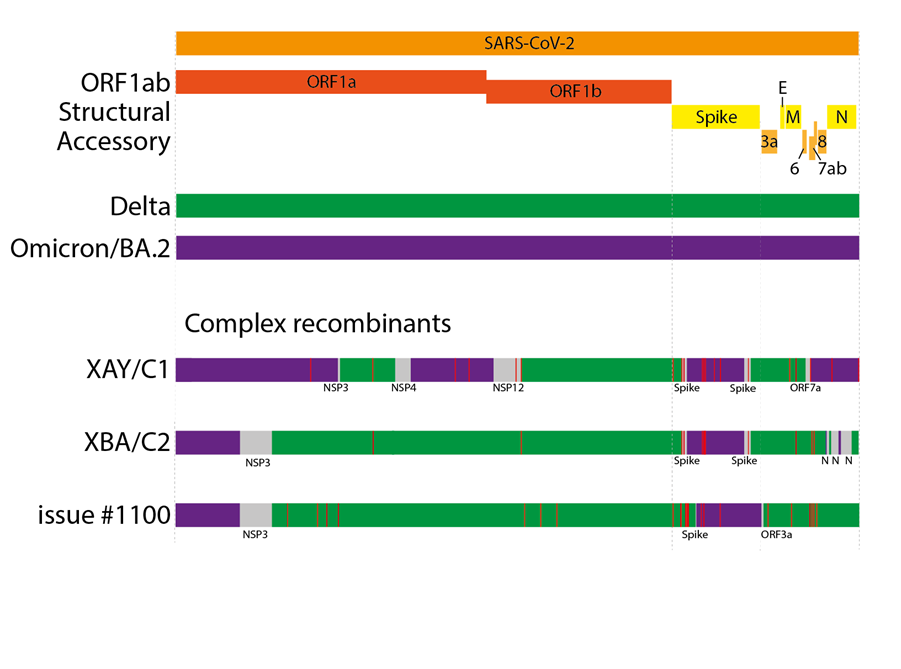  

# Variant report 2023-06-29

## Macro variant trends

At the beginning of June 2023, XBB had grown to make up at least 95% of global SARS-CoV-2 circulation. The only exceptions are Australia and New Zealand.

In Australia, XBC (particularly XBC.1.6) has grown to 15-20% at the beginning of June. XBC.1.6 appears to be competitive with XBB sublineages like XBB.1.16. With XBC.1.6 not establishing itself outside of Australia, this effect appears to be due to Australia's unique variant exposure history.

For New Zealand, the most recent data from mid May showed FK.1 (a CH.1.1 sublineage) growing to 35% despite XBB + F486P being in the majority. However, XBB.1.16 appeared to be growing faster than FK.1.

BA.2.3.20*, mostly as FV.1 (with S:R346T now), is slowly disappearing. In the Philippines, BA.2.3.20 was dominant until February 2023 when XBB outcompeted it. FV.1 appears now most commonly in Japan though only at around 1%.

CH.1.1*, mostly as FK.1*, is still present in Oceania and at low levels in Europe, but does not appear to be growing.

BN.1* is still somewhat common in China as FR.1* at 2-4% but at decreasing levels.

The most noteworthy non-XBB development in the last month is the emergence of GL.1 (XAY.1.1.1 with S:D420N and S:Y144-) across Europe (Spain, Italy, UK, Ireland, Portugal). Numbers are still very low with 27 sequences, around 0.1% of sequences collected since May in Europe and it is not clear how fast and how long it will grow. It is also not clear whether it will be able to compete with emerging XBB sublineages.

## EG.5 (XBB.1.9.2 with S:F456L)

The globally fastest growing lineage with significant circulation is currently EG.5 (XBB.1.9.2 with S:F456L). S:F456L is known to confer immune escape. The majority of EG.5 has acquired extra S:Q52H (defining EG.5.1) which might also be a slightly beneficial mutation.

EG.5 was first sequenced in Indonesia in February 2023 where it appears stable at around 1%. In the US, it was first observed in March 2023, it has grown to around 5% at the beginning of June. EG.5 is globally most common in China where it was first sequenced in April 2023 and has quickly grown to around 15% at the beginning of June.

The growth advantage compared to all other XBB with 486P appears to currently be on the order of 50% per week, doubling around every 2 weeks.

## Non-XBB development: GL.1 (XAY.1.1.1 with S:D420N and S:Y144-)

XAY is a Delta-Omicron recombinant. The NTD is from Delta (breakpoint between 159 and 212), the rest of the Spike is BA.4/5-like. However, XAY has important extra mutations in the Spike beyond what's derived from the donors: in particular S:F486P (known as XBB.1.5-defining), and S:G446D (XBB has similar S:G446S).

Expand for full list of Spike mutations of XAY by donor

Extra mutations in addition to the donors:
- L18F
- R21G
- Y144- (starting with GL.1=XAY.1.1.1.1)
- W152L
- F186L
- D253G (starting with XAY.1)
- R346T (starting with XAY.1.1)
- D420N (starting with GL.1=XAY.1.1.1.1)
- G446D
- F486P
- P621S
- A706V
- T1171I
- D1153Y (starting with XAY.1.1.1)

Mutations from Delta donor:
- T19R
- T95I
- G142D
- E156G
- del157/158

Mutations from BA.4/5-like donor (donor is not exactly BA.4/5 as XAY has F486P not F486V):
- V213G
- G339D
- S371F
- S373P
- S375F
- S376A
- D405N
- R408S
- K417N
- N440K
- L452R
- S477N
- T478K
- E484A
- Q498R
- N501Y
- Y505H
- D614G
- H655Y
- N679K
- P681H
- N764K
- D796Y
- Q954H
- N969K

  

XAY was first sequenced in South Africa in June 2022 where it made up around 1% of sequences in the second half of 2022, peaking at 2% around September 2022.

At the end of 2023, XAY appeared in Europe, in particular Denmark, where XAY.2 reached a peak of 4% in January/February 2023.

XAY.1.1 with extra S:D253G and S:R346T, established itself in Germany in February/March/April 2023 at around 1%, Most of it being XAY.1.1.1 with extra S:D1153Y.

XAY* was only sporadically observed on other continents.

End of March 2023, GL.1 (XAY.1.1.1.1) with extra S:D420N and S:Y144- was first sequenced in Spain in Alicante. In April, GL.1 was also observed in Luxembourg, Italy and Spanish Galicia. In May, GL.1 was newly found in Portugal, Ireland, England, Wales, Austria, Italy and in Spain on the Canary Islands and in Murcia. In the limited samples available from June, it was sequenced in Australia, Wales, Ireland, Austria and the Spanish Canary Islands.

With only 27 sequences to date, it's too early to tell how fast GL.1. With 2/3 of XAY* collected since May having S:D420N, this extra mutation does appear to confer a growth advantage to XAY.1.1.1. Whether it's enough to compete with XBB sublineages. Before acquiring S:D420N, XAY appears to have only been competitive in particular niches, particularly  in Germany and Denmark.

## Major XBB branches

Due to convergence of RBD mutations, it is worthwhile to split XBB evolution into two parts: non-RBD and RBD evolution.

A few lineages make up the bulk of XBB with S:F486P (almost no XBB is still around without this mutation), with shares given as proportion of global XBB sequences with S:F486P:
- XBB.1.5 (~25% share, decreasing by ~20% per week)
- XBB.1.16 (~25% share, growing ~15% per week)
- XBB.1.9.1 (~20% share, stable)
- XBB.1.9.2 (~15% share, growing by ~15% per week)
- XBB.1.22 (~4% share, growing by ~15% per week)
- XBB.1.18.1 (~1% share, mostly Brazil)
- XBB.2.3 (~8% share, growing by ~15% per week)
- Other (~2% share)

Growth needs to be taken with a big grain of salt as it is heavily influenced by which countries sequence most and how that sequencing volume changes over time.

XBB.1.9*, XBB.1.16, and XBB.1.22 all share mutation ORF9b:I5T.

XBB.1.9.1 and XBB.1.9.2 share extra ORF1a:G1819S, ORF1a:T4175I.

XBB.2.3 differs from the others in Spike by having S:D253G instead of S:G252V and S:P521S.

## Convergent evolution in XBB sublineages

456L is very homoplasic, present in ~10% of XBB + 486P at the end of May with a growth advantage of 25% per week (compared to XBB + 486P).

478R is also homoplasic, present in ~25% of XBB + 486P at the end of May but a slightly lower growth advantage of ~20% per week (compared to XBB + 486P).

456L and 478R appear to be able to combine their growth advantages, with potentially up to 50% per week over XBB + 486P. However, this combination was observed in only ~0.4% of XBB + 486P at the end of May (though slightly higher if focusing on US alone at ~1%). Most common lineages with this haplotype are:
- FL.1.5.1 (XBB.1.9.1 sublineage with extra S:A701V)
- EG.2.1 (XBB.1.9.2 sublineage with extra S:V327I)
- XBB.1.16.9
- XBB.1.16.6
though there are more arising, as expectable from the growth advantage.

### Slightly beneficial mutations

S:Q613H has appeared in a few lineages, although most of it is due to EG.1, and is present in ~7% of XBB + 486P at the end of May with a growth advantage of ~15% per week (compared to XBB + 486P).

S:E554K is most prominent in XBB.1.19.1 but has also appeared in other XBB lineages. End of May it was present in ~1% of XBB + 486P with a growth advantage of ~15% per week (compared to XBB + 486P).

## Sequencing volume over time and regions

### Submission volume over time with various submission delays

Number of sequences (in thousands) with collection date within X months of cutoff date:
| Submission cutoff | within last 1 month | within last 2 months | within last 3 months | within last 4 months |
| ----------------- | ------------------- | -------------------- | -------------------- | -------------------- |
| 2023-06-21        | 21                  | 95                   | 225                  | 384                  |
| 2023-05-24        | 25                  | 134                  | 287                  | 484                  |
| 2023-04-24        | 49                  | 190                  | 383                  | 638                  |
| 2023-03-24        | 65                  | 244                  | 491                  | 837                  |
| 2023-02-24        | 89                  | 323                  | 660                  | 963                  |

### Submission volume by region and cutoff

On 2023-06-21, number of sequences with collection date within X months:

| Region        | Within last 1 month | Within last 3 months |
| ------------- | ------------------- | -------------------- |
| Africa        | 42                  | 1557                 |
| Asia          | 7505                | 60099                |
| Europe        | 6042                | 76352                |
| North America | 4837                | 67692                |
| Oceania       | 2402                | 14149                |
| South America | 236                 | 4757                 |

All data from GISAID via covSpectrum, queried on 2023-06-28.

# Variant report 2023-05-24

## Macro variant trends

The general trend towards XBB* domination continues. In sequences collected at the end of April, only around 5-10% were non-XBB*, down from 15-20% at the end of March and 30-35% at the end of February.

XBB* is now clearly dominating in China, South Korea and Japan, countries that had relatively large proportions of non-XBB* at the time of writing of the previous report from a month ago.

The following figures show non-XBB* proportions in select countries, grouped by continent.

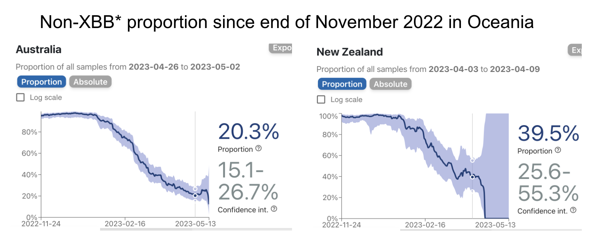
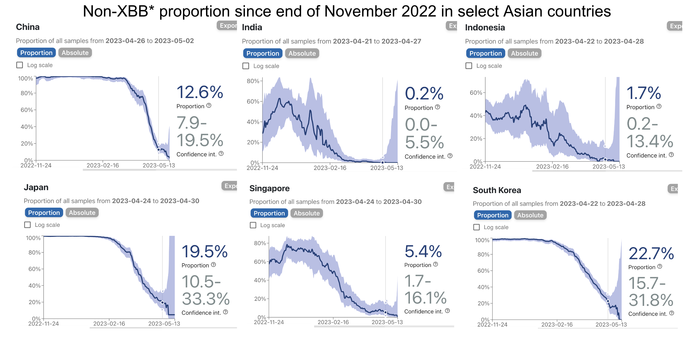  
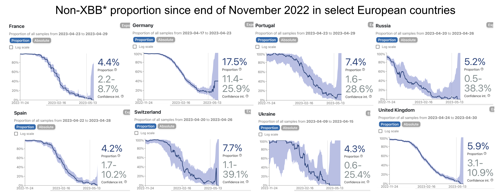  
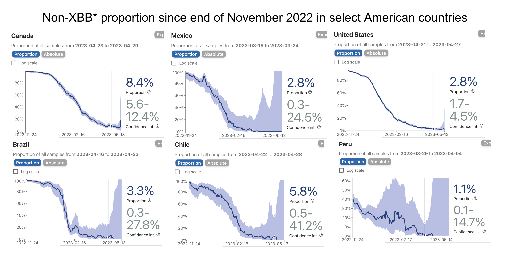
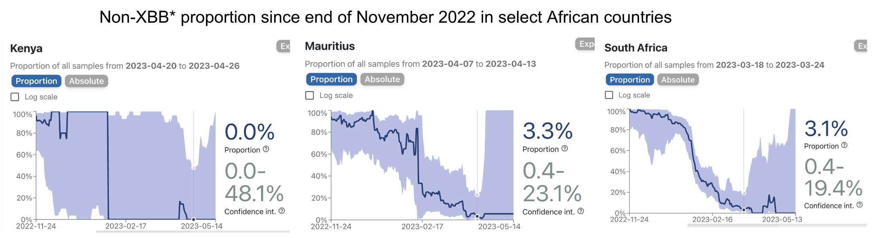
(all plots generated with cov-spectrum.org via data from GISAID)

While the timing of XBB* dominance differs by continent and country, in all countries with data on all continents, XBB makes up at least 80% of sequences, the only exception being Oceania where New Zealand had 40% non-XBB* at the beginning of April.

### Significant remaining non-XBB* diversity

### BN.1* (=BA.2.75.5.1*)

- The only country that shows some BN.1* growth is China, where it represented around 4% most recently. However, XBB* seems to clearly outcompete BN.1* there
- Used to be common in East Asia (South Korea/Japan), but XBB* has now taken over
- Most interesting sublineage: FR.1 (S:187E) in Taiwan/China

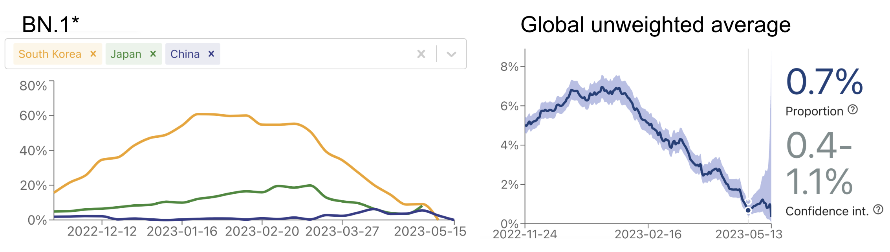  

### CH.1.1* (=BA.2.75.3.4.1.1.1.1*)

- Used to be common in Europe/Oceania, still relevant in New Zealand and Denmark
- Most interesting sublineage: FK.1* (S:D215G, S:Q613H) in New Zealand, Australia, Denmark

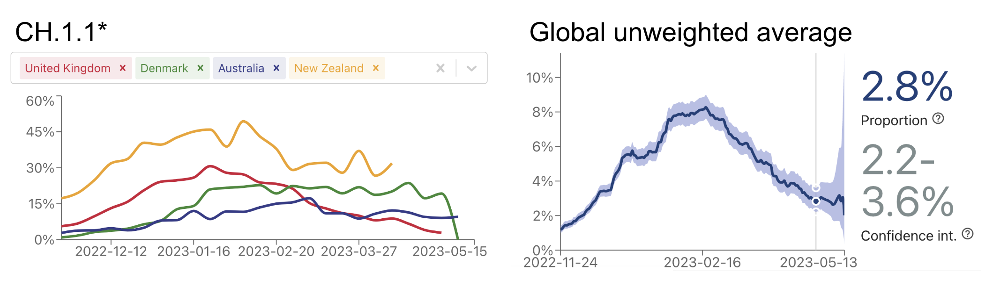  

### BA.2.3.20*

- Used to be common in Philippines but no recent data from there
- Most interesting sublineage: FV.1 (S:K147N,  S:R346T, S:G446S, S:F486S) potentially growing in Japan, Hong Kong, South Korea but still at very low level

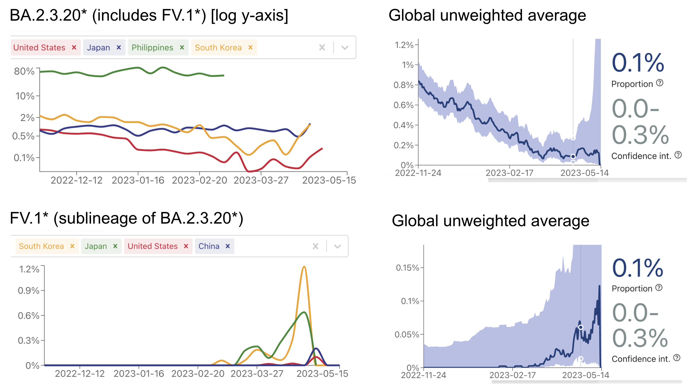  

### XBC*

- Delta-Omicron recombinant
- Common in Philippines and Australia
- Most interesting sublineage: XBC.1.6 (extra S:R346S, S:L452R) almost exclusively in Australia
- So far no evidence of sustained XBC.1.6* growth outside of Australia

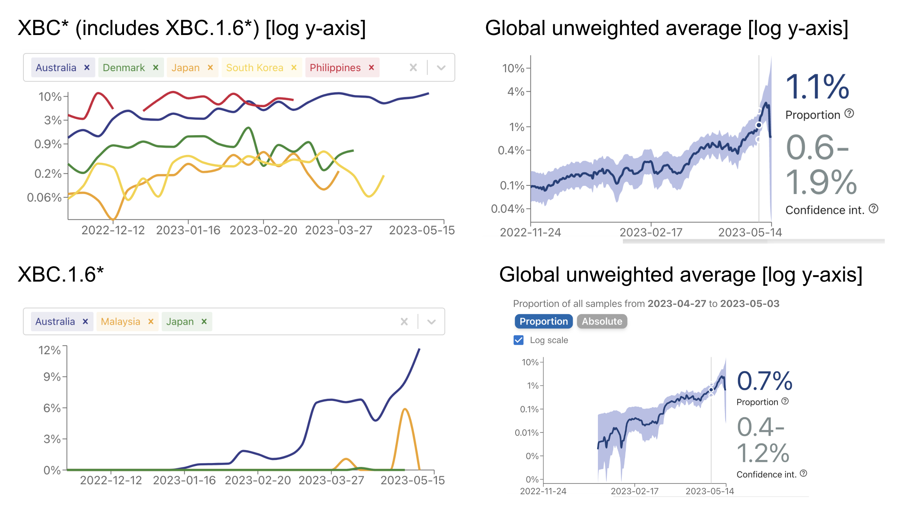  

### XAY*

- Delta-Omicron recombinant
- First identified in South Africa. Established itself in Germany/Denmark. Has disappeared in South Africa.
- Most interesting sublineage: XAY.1.1* added S:R346T and has been stable at around 1% in Germany. Spotted occasionally around the world, but doesn't seem to grow much.

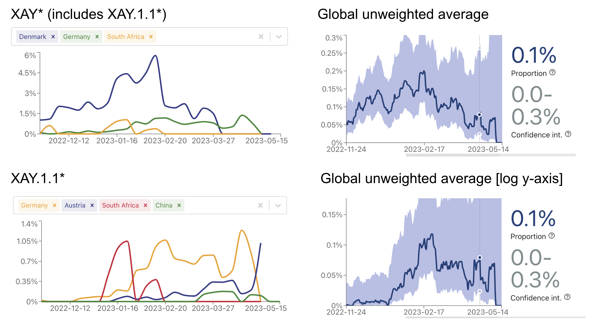  

### BA.5*

- BA.5* and its sublineage BQ.1* have continued trending downwards

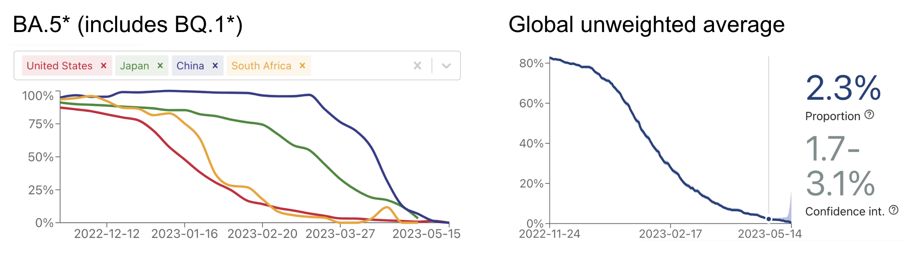  

## Within-XBB* trends

### S:486P has essentially fixed

S:486P has essentially fixed within XBB*, there is almost no S:486S left by now:
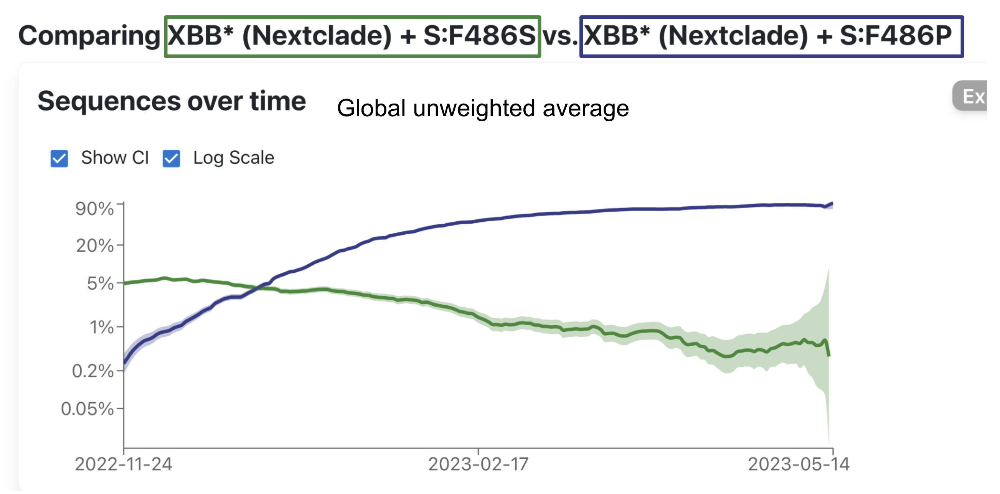  

S:486P has been acquired independently in many XBB* sublineages. Some of the lineages seem to have a growth advantage over others:
- XBB.1.5* was the first known lineage with S:486P but its share is receding
- XBB.1.9.1* and XBB.1.9.2* seem to have a growth advantage over XBB.1.5, despite not Spike difference
- XBB.2.3* is also outgrowing XBB.1.5, it differs from the above by having S:253G instead of S:252V and an additional S:521S

### S:478R keeps growing within XBB*

The addition of S:478R appears to confer a growth advantage to XBB* + S:486P lineages. About a fifth of recent global XBB* + 486P have also got 478R, up from less than 1% in February:
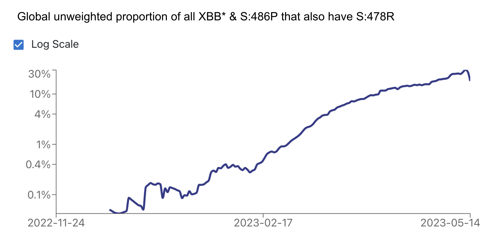  

A selection of XBB* + 486P lineages with 478R are:
- XBB.1.16 (also has S:180V)
- XBB.2.3.8 and XBB.2.3.11 (also has S:521S and S:253G instead S:252V)
- EG.2 (XBB.1.9.2.2)
- XBB.1.5.28

### S:456L is also potentially beneficial

As predicted by deep mutational scanning experiments, S:456L is another beneficial immune escape mutation in XBB*, albeit with a somewhat smaller growth advantage than S:478R. At the beginning of May, around 5% of global XBB* sequences with 486P also had S:456L
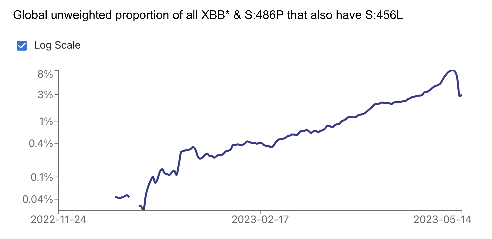  

Lineages with S:456L include:
- FD.1.1 (XBB.1.5.15.1.1, Canada)
- XBB.1.5.10
- XBB.1.5.59
- FE.1* (XBB.1.18.1.1*, dominant in Brazil)
- EG.5 (XBB.1.9.2.5*, Indonesia/China)

It's not yet clear whether co-occurrence of 456L and 478R is beneficial beyond having either of them alone. There are only 3 sequences with both mutations so far. At the time of writing, the combination XBB* + S:486P + S:456L + S:478R has only been observed in 38 sequences, mostly in the XBB.1.16 sublineage XBB.1.16.6.

### Other slightly beneficial mutations

- S:613H (already in 5% of XBB* sequences with 486P)
- S:521S (defining of XBB.2.3*, in ~5% of XBB* sequences with 486P)
- The combination S:L455F + S:F456L in addition to 486P is potentially beneficial beyond 456L. Lineage XBB.1.5.70 appears to grow in Brazil.

## Sequencing volume over time and regions

### Submission volume over time with various submission delays

Number of sequences (in thousands) with collection date within X months of cutoff date:
| Submission cutoff | within last 1 month | within last 2 months | within last 3 months | within last 4 months |
| ----------------- | ------------------- | -------------------- | -------------------- | -------------------- |
| 2023-05-24        | 25                  | 134                  | 287                  | 484                  |
| 2023-04-24        | 49                  | 190                  | 383                  | 638                  |
| 2023-03-24        | 65                  | 244                  | 491                  | 837                  |
| 2023-02-24        | 89                  | 323                  | 660                  | 963                  |

### Submission volume by region and cutoff

On 2023-05-24, number of sequences with collection date within X months:

| Region        | Within last 1 month | Within last 2 months | Within last 3 months | Within last 4 months |
| ------------- | ------------------- | -------------------- | -------------------- | -------------------- |
| Africa        | 91                  | 608                  | 1899                 | 3791                 |
| Asia          | 4964                | 30652                | 54541                | 85533                |
| Europe        | 8041                | 48731                | 117587               | 194794               |
| North America | 9720                | 45095                | 96575                | 176337               |
| Oceania       | 2239                | 7452                 | 12075                | 16666                |
| South America | 141                 | 1699                 | 4212                 | 6952                 |

All data from GISAID via covSpectrum.

# Variant report 2023-04-27

## XBB

XBB descendants continue growing across the globe. In sequences collected at the beginning of April, less than 15% were non-XBB*, about half the proportion a month earlier (30% beginning of March).

At the start of April, there was particularly little non-XBB* left in the USA (<5%). China had the highest proportion of non-XBB* (~75%) though XBB* is quickly making inroads there as well. Japan and South Korea also still have sizeable non-XBB* proportions.

Spike mutation S:486P is now present in the vast majority of XBB*: less than 5% of XBB* do _not_ have 486P.

The major XBB* sublineages are currently: XBB.1.5*, XBB.1.9.1*, XBB.1.9.2*, XBB.2.3* and XBB.1.16*.

### XBB.1.16

XBB.1.16* has grown to dominance in India and is increasing globally. The extra advantage over XBB.1.5*-like lineages appears to be mutation S:478R (in addition to 486P). As seen with 486P, 478R has arisen multiple times within XBB and appears to predictably confer a growth advantage in the lineages that acquire it (the more beneficial a mutation, the more often it arises independently, recall 346T in BA.5).

While XBB.1.16* is currently the most prominent XBB lineage with both 486P and 478R, other such lineages could in the mid-term replace it.

India, where XBB.1.16* has been dominant since end of February, has seen a steep rise in confirmed cases which have grown by a factor of 100 since the start of February. It is difficult to say to which extent this wave is driven by XBB.1.16* and to which extent it is a seasonal effect: a strikingly similar pattern (40-fold growth from beginning of February to end of April) was seen at exactly the same time of year in 2021. Back then, the wave coincided with the emergence of Delta. So the answer is possibly both effects matter: emergence of new variant and seasonal effects.

A comprehensive discussion of XBB.1.16, including clinical properties, can be found in the recent [WHO Risk Assessment](https://www.who.int/docs/default-source/coronaviruse/21042023xbb.1.16ra-v2.pdf?sfvrsn=84577350_1) from April 17.

Further links: [case graph (OWID)](https://ourworldindata.org/explorers/coronavirus-data-explorer?yScale=log&time=2020-03-01..latest&facet=none&country=~IND&hideControls=true&Metric=Confirmed+cases&Interval=7-day+rolling+average&Relative+to+Population=false&Color+by+test+positivity=true)

### Mutations to watch for in XBB

In addition to 486P and 478R, a number of other Spike mutations have been observed repeatedly in XBB*. While some, like 456L, did not initially appear to confer a significant growth advantage, growth (dis)advantages conferred by mutations can change over time, as population immunity builds against a variant. Recently, 456L has started to appear independently and grow in frequency. What is currently only a slight growth advantage (~20% per week) could grow in the future.

Besides 456L, mutations 403K and 521S have been observed to increase in share and are part of a number of lineages. This list is not exhaustive.

## Remaining non-XBB diversity

In particular for vaccine variant selection, it is important to keep an eye on remaining non-XBB diversity (~15%): the fewer non-XBB there are, the more obvious and less risky a switch to XBB (or sublineage thereof) is.

The non-XBB diversity can be broken down roughly into (share is always with collection date beginning of April)

- BA.2.75* (Nextstrain clade 22D, mostly BN.1* and CH.1.1*): ~5%, decreasing steadily at ~10-20% per week, most common in South Korea (BN.1*, ~40%) and Europe (CH.1.1, ~5-10%)
- BQ.1* (Nextstrain clade 22E, mostly BQ.1.1*): 4%, decreasing at 20-30% per week, most common in Canada (10%) and Japan (10%)
- BA.5* excluding BQ.1* (Nextstrain clade 22B, mostly BA.5.2.48* and BF.7*): ~3%, decreasing at 10-20% per week, most common in China (BA.5.2.48, BF.7.14*, 70%) and Japan (BF*, 25%)
- BA.2* excluding BA.2.75* (Nextstrain clade 21L, mostly BA.2.3.20): 0.2%, decreasing slowly at 5-15% per week, most common in Philippines (no recent data, but was 50% in February, particularly CM.8.1), Japan (1%) and India (0.5%)
- recombinants similar to BA.2.75* and/or XBB*: 1%, decreasing at 10-20% per week, most common in Australia (XBF, 5%)
- XBC* (Delta-Omicron recombinant): 0.3%, potentially increasing at 10-20% per week, most common in Australia (XBC.1.6, 10%) and Philippines (no recent data, but known to be common in February at 10%)
- XAY* (Delta-Omicron recombinant): 0.1%, ~steady, most common in Denmark (1%, XAY.2) and Germany (1%, XAY.1.1)

While the future is most likely to look like XBB*, it is possible that BA.2.75* may play a role (potentially through recombination with XBB, like recently designated XCC). There is a small but non-zero chance, that a more divergent lineage may emerge from XBC, XAY or BA.2.3.20

## Feedback or questions

If you have feedback or questions, feel free to open an issue [here](https://github.com/neherlab/SARS-CoV-2_variant-reports/issues/new) or send an email to cornelius.roemer@unibas.ch

# Variant report 2023-03-28

## XBB\* keeps growing worldwide

The global trend towards XBB\* continues. In the US, XBB\* lineages were found in >90% of samples with collection date 2 weeks ago. In most countries, XBB\* now makes up more than 50% of samples.

Countries that seem to have had fewer infections to date, most notably China, seem to lag somewhat behind countries with more infections. Other countries with recent data and well below average XBB\* share are Japan and South Korea.

### XBB.1.16

A lineage that has got attention on Social Media recently is XBB.1.16. XBB.1.16 appears to be particularly widespread in India where it appears to have accounted for >50% of samples collected 2 weeks ago.

XBB.1.16 differs from XBB.1.5 by having two extra Spike mutations: E180V and K478R. Sublineage XBB.1.16.1 (~20% of XBB.1.16\*) has the Spike mutation T547I on top.

Amino acid 478 is T in wild type and mutated to K in all Omicrons (via a C->A mutation). In XBB.1.16, the nucleotide A has now mutated further to G, resulting in amino acid R. This is hence not a 2-step mutation in the sense that it always requires 2 nucleotide substitutions. R can be reached from T via a single substitution C->G.

Given that 478 is in the receptor binding domain and mutated in Omicron, it is not unreasonable that mutation provides additional immune escape.

Site 180 is in the N-terminal domain, in a region that has seen a number of slightly beneficial mutations. So it is not unreasonable to assume that E180V could also provide some additional immune escape.

Given India's size, population and fairly low number of sequences compared to population, it is difficult to estimate the growth advantage of XBB.1.16 compared to XBB.1.5 (or other XBB with 486P but without E180V and K478R) in India. There does seem to be a slight growth advantage but it could range from 30% to 80% per week - which is significant but not as big as growth advantages seen in the past for lineages like XBB.1.5\*, BQ.1.1\* or the first Omicron.

XBB.1.16 has been observed outside India: In Singapore it made up around 5% of samples collected 2 weeks ago, in the US and Europe, it is still rare (just below 1% of samples collected 2 weeks ago) but growing. Given the small number of sequences so far outside of India (~250), it is difficult to reliably estimate the growth advantage of XBB.1.16 compared to XBB.1.5\* in other countries. It is possible that the growth advantage in India is bigger than in other countries, as population immunity varies based on number and time of infections and variant exposure.

Independent from XBB.1.16, K478R has also been observed in other XBB\* with 486P. In these cases, the global growth advantage appears to be modest, only on the order of [10-20%](https://cov-spectrum.org/explore/World/AllSamples/Past3M/variants?variantQuery=nextcladePangoLineage%3AXBB*+%26+S%3AF486P+%26+%21nextcladePangoLineage%3AXBB.1.16*&variantQuery1=%21nextcladePangoLineage%3AXBB.1.16*+%26+S%3AK478R+%26+XBB*+%26+S%3AF486P&analysisMode=CompareToBaseline&) per week. However, there is not much data so time will have to tell how beneficial K478R is on its own.

#### EU.1.1

Lineage EU.1.1 (alias of XBB.1.5.26.1.1) has additional Spike mutations I410V and P521S and appears to be outgrowing the parent XBB.1.5\* in Europe (the alias EU is entirely coincidentally the same as the country code for the European Union). The growth advantage appears to be on the order of [25-60%](https://cov-spectrum.org/explore/Europe/AllSamples/Past3M/variants?aaMutations=S%3A486P&nextcladePangoLineage=XBB*&aaMutations1=S%3A410V%2CS%3A521S&nextcladePangoLineage1=XBB*&analysisMode=CompareToBaseline&), similar to the growth advantage of R346T in BA.5 and BQ.1.

#### Other potentially beneficial Spike mutations

There are a number of Spike mutations that appear to be rising in frequency in XBB\* lineages. They are still to rare to allow for reliable estimation of growth advantage but they are worth keeping an eye on:

- S:D80Y
- S:D215H
- S:M177I
- S:F456L
- S:P621S
- S:N978S
- S:K1045R

## Non-XBB lineages

Even though XBB\* lineages are increasingly dominating the global picture, it is important to watch non-XBB\* diversity as there is potential for such lineages to have a large antigenic distance to the currently circulating XBB\* lineages.

### Delta-Omicron recombinants
- The Delta-Omicron recombinant XBC\* recently made up around 5% of sequences in Australia. There is a new sublineage XBC.1.6 with two interesting Spike mutations: R346S and M452R. This lineage has grown quickly to 1-2% in Australia but has not been sequenced anywhere else.
- XAY\* is still at around 2% in Denmark and may potentially still be growing in Germany (as XAY.1.1) where it is at ~1%.

### BA.2.75 sublineages and recombinants
- CH.1.1\* proportions are still fairly constant in Europe at 10-20%, though it is expected that XBB\* will eventually outgrow CH.1.1\* unless CH.1.1\* acquires new beneficial mutations
- BN.1\* is still prevalent in some countries, especially in South Korea
- BR.2.1 has dropped from a peak of 20% to below 5% in Australia.
- XBF\* has dropped to ~10% from a peak of 30% in Australia in January. It is observed at roughly constant ~1% in Europe.

### BA.5 sublineages
- BA.5\* (non-BQ\*) have gone below 2% with the exception of Japan (~25%) and China (~90%).
- BQ.1* has decreased below 10% in Europe and the Americas (from a peak of 50-80% in December 2022)

### BA.2 sublineages
- BA.2.3.20 is still observed sporadically around the world, and roughly constant in South Korea and Japan at ~1% (it is expected to be most common in the Philippines, but the most recent data is 6 weeks old)

## China

The situation in China is discussed for continuity with previous reports and because China is a unique case due to late pandemic arrival and strict control measures. There are currently no indications that SARS-CoV-2 evolution in China poses a particular threat regarding variant evolution beyond what one would expect for a country that hosts almost 20% of the world's population.

### Data from China

#### Sequence submission volume

Sequence submissions from China seem to have stabilized between 500 and 1100 a week.

| Submission Date Range    | Sequences collected post Nov '21 |
| ------------------------ | -------------------------------- |
| 2023-12-29 to 2023-01-04 | 0.57k                            |
| 2023-01-05 to 2023-01-11 | 0.16k                            |
| 2023-01-12 to 2023-01-18 | 0.27k                            |
| 2022-01-19 to 2022-01-25 | 5.0k                             |
| 2022-01-26 to 2022-02-01 | 2.3k                             |
| 2022-02-02 to 2022-02-08 | 1.1k                             |
| 2022-02-09 to 2022-02-15 | 0.62k                            |
| 2022-02-16 to 2022-02-22 | 0.53k                            |
| 2022-02-23 to 2022-03-01 | 0.71k                            |
| 2022-03-02 to 2022-03-08 | 1.0k                             |
| 2022-03-09 to 2022-03-15 | 1.1k                             |
| 2022-03-16 to 2022-03-22 | 0.58k                            |

#### Lineage prevalence within China

The vast majority of sequences still belongs to 3 of the previously discussed China-characteristic lineages: BA.5.2.48, BF.7.14, BA.5.2.49.

Breakdown of the major lineages of the 3.5k samples collected since January 23rd 2023:

| Lineage                                                                  | Proportion |
| ------------------------------------------------------------------------ | ---------- |
| BA.5.2.48                                                                | 60%        |
| BF.7.14                                                                  | 30%        |
| BA.5.2.49                                                                | 6.2%       |
| XBB*                                                                     | 0.77%      |
| BN.1*                                                                    | 0.63%      |
| BA.5.2.50                                                                | 0.57%      |
| BA.5.1.32                                                                | 0.54%      |
| rest (mostly low quality sequences actually belonging to above lineages) | 1.7%       |

There are first signs of circulation of new lineages in China. Sequences of BN.1\* and XBB.1.5-like sequences are on the rise. However, there are so few of these sequences in China that it is not possible to calculate local growth advantages yet. Most BN.1\* and XBB.1.5-like sequences come in singlets or small clusters from the same province with similar dates. However, there are first signs of local circulation: In Guangdong, a cluster of BN.1.3.9 sequences has been found with sequences from mid January to mid March. Two identical XBB.1.22.1 (XBB.1.5-like) have been found in two different provinces: Anhui and Hubei in the last month. A cluster of 3 sequences from 2 provinces: Liaoning and Jiangsu have been found in the last month.

Mutations that are rising in China (though the apparent growth could also be due to changing regional sampling bias):
A few mutations seem to be rising within China-characteristic lineages. These mutations are:

- S:T572I (in various clusters)
- S:G446D (in DY.3=BA.5.2.48.3, mostly Guangdong, Henan, Hainan)
- S:G446S (across multiple lineages)

All of these mutation clusters don't cluster well, either due to low sequence quality or homoplasy, hence they have not been designated as lineages yet.

# Variant report 2023-02-28

## China

### Data from China

#### Sequence submission volume

Sequence submissions from China seem to have peaked in mid January and have decreased significantly since then. In the most recent week, only around 600 sequences with collection date since 2022-11-01 have been submitted to GISAID. This is much less than high-sequencing intensity countries, especially considering China's large population. While China submitted around a thousand recent sequences in a week starting February 2023, the US submitted 20k, Japan 8k, Canada 4k, Austria 4k, UK 4k, France 3k, Germany 2.5k, South Korea 1.7k - all more than China despite their much smaller population. All 30 provinces but Xizang (Tibet) have now submitted sequences in the past 3 months.

| Submission Date Range    | Sequences collected post Nov '21 |
| ------------------------ | -------------------------------- |
| 2023-12-29 to 2023-01-04 | 0.57k                            |
| 2023-01-05 to 2023-01-11 | 0.16k                            |
| 2023-01-12 to 2023-01-18 | 0.27k                            |
| 2022-01-19 to 2022-01-25 | 5.0k                             |
| 2022-01-26 to 2022-02-01 | 2.3k                             |
| 2022-02-02 to 2022-02-08 | 1.1k                             |
| 2022-02-09 to 2022-02-15 | 0.62k                            |
| 2022-02-16 to 2022-02-22 | 0.53k                            |

#### Lineage prevalence within China

The vast majority of sequences still belongs to the China-characteristic 5 lineages mentioned in previous reports: BA.5.2.48, BF.7.14, BA.5.2.49, BA.5.2.50, BA.5.1.32. 

Breakdown of the major lineages of the 5.2k samples collected since 1st of January 2023:

| Lineage                                                                  | Proportion |
| ------------------------------------------------------------------------ | ---------- |
| BA.5.2.48                                                                | 62%        |
| BF.7.14                                                                  | 28%        |
| BA.5.2.49                                                                | 6.4%       |
| BA.5.2.50                                                                | 1.2%       |
| BA.5.1.32                                                                | 0.4%       |
| rest (mostly low quality sequences actually belonging to above lineages) | 2.3%       |

None of the circulating lineages seem to have any clear growth advantage over the others. 

There is so far no sign that other lineages have started circulating in the community - though the small number of sequences makes this impossible to rule out. Recently, the first XBB.1.5-like sequence was submitted. None of the lineages dominating in the rest of the world like BQ.1*, BA.2.75* or XBB* seem to have been found in more than singlets to date.

None of the Spike mutations that have arisen within lineages seem to show a large growth advantage. 

### Sequences from travelers from China

Around 150 sequences have been submitted in February annotated as coming from travelers from China (~100 from South Korea, ~40 from Taiwan, ~30 from Japan).

The lineage breakdown in these sequences is consistent with the distribution from Chinese sequences. The few non-China-characteristic lineages are feasibly explained by being acquired outside of China. 

## XBB.1.5-like lineages

XBB.1.5-like lineages (XBB with S:F486P) continue to grow worldwide, on all continents, with the possible exception of China.

While XBB.1.5-like lineages vary in their relative share across the world, their share is going up everywhere. In recent samples from the US North East, XBB.1.5 makes up around 90% of sequences. On the other end of the spectrum is Japan where XBB + S:F486P was responsible for around 1-2% of sequences at the beginning of February.

Besides XBB.1.5, the major XBB-lineage with S:F486P is XBB.1.9.2. This lineage is most common in South East Asia: in particular Singapore, Indonesia and Malaysia. However, there are at least 5 other XBB-lineages with S:F486P and it is possible that they are common in areas where sequencing coverage is low.

### Mutations in XBB.1.5-like lineages

One notable Spike mutation to have arisen in XBB.1.5-like is S:Q613H - a mutation which has been observed repeatedly in the past: within Delta (e.g. AY.27 which reached 25% in Canada) within BA.2, within BQ.1.1 (e.g. BQ.1.1.29 and BQ.1.1.43) and within CH.1.1. S:Q613H is the defining mutation of EG.1 (a XBB.1.9.2 sublineage).

## Heterogeneity between countries

There are notable heterogeneities between countries in terms of which lineages persist for how long. In Japan, for instance, plain BA.5s (without S:144-, S:R346T, S:K444T or S:N460K) still make up almost 20% of sequences. On the other end of the spectrum is Peru, where such "plain" BA.5s dropped below the 20% mark already at the end of November. The differences between countries appear to be not just the result of change. Plausibly, the differences can be explained by differences in population immunity.

Another example is XAY, which was first observed in South Africa, but never went above more than 1-5% there. In Denmark, and almost exclusively in Denmark, XAY has been growing steadily, recently topping 5%. The explanation for this may at least partially revolve around Denmark being one of the few countries where BA.2 was the first variant to infect the majority of the population. In most other countries this was either Delta or BA.1.

# Variant report 2023-02-03

## China

### Data from China

China has significantly increased the number of recent sequences (defined as after 1st of November 2022) submitted in the past two weeks. Submissions to GISAID in 1 week windows have been as follows:

| Submission Date Range    | Value |
| ------------------------ | ----- |
| 2023-12-29 to 2023-01-04 | 0.57k |
| 2023-01-05 to 2023-01-11 | 0.16k |
| 2023-01-12 to 2023-01-18 | 0.27k |
| 2022-01-19 to 2022-01-25 | 5.0k  |
| 2022-01-26 to 2022-02-01 | 2.3k  |

Recent increases represent an approximately 10-fold increase. Given its large population, China is still submitting about 10 times fewer sequences relative to population than high intensity sequencing countries like the US, UK, Japan. Submissions have now come from almost all provinces, though major cities like Beijing and Shanghai are significantly overrepresented.

The major lineages in the 6.4k samples collected since 1st of December 2022 are:

| Lineage   | Proportion |
| --------- | ---------- |
| BA.5.2.48 | 58%        |
| BF.7.14   | 29%        |
| BA.5.2.49 | 6%         |
| BA.5.2.50 | 1.3%       |
| BA.5.1.32 | 0.3%       |
| rest      | 5%         |

A large part of the rest is made up of import clusters without apparent community circulation, often reported by quarantine facilities. None of the lineages dominating in the rest of the world like BA.2.75* or XBB* have been found in distinctly Chinese clusters yet - though given the limited number of sequences, this is not possible to rule out.

As is normal for this virus, additional Spike mutations have arisen in the lineages circulating in China, but the mutations observed are not unknown to occur in a BA.5 backbone. There is no evidence of large evolutionary jumps so far, where numerous Spike mutations are appear together in one lineage.

### Sequences from travelers from China

In the past two weeks, around 400 more sequences annotated as coming from travelers from China have been uploaded to GISAID, in particular by labs in Japan and South Korea.

The sequences are consistent with the data released from China itself. The occasional non-China-characteristic lineage can feasibly be explained as acquired outside of Chinese community circulation, e.g. infection from a traveler from another traveler in hotel/airplane.

Though the small number of sequences annotated as coming from travelers means low level circulation at a level of up to 1% especially in regions not often visited by travelers could evade detection for a while.

Unfortunately, only few labs annotate their sequences with travel history (usually searchable with keyword `travel`), notably the following:
- Japan's National Institute of Infectious Diseases in collaboration with Airport Quarantine Stations (inclusion of `IC` in sequence names makes it particularly easy to query and analyze sequences from travellers, this is a practice that would be helpful if adopted by other labs)
- Korea Disease Control and Prevention Agency
- National Public Health Laboratory, Singapore
- California Department of Public Health with the Airport Antigen COVIDNet Project
- Gingko Bioworks as part of US Airport Screening (searchable via `traveler` and `traveller`
- Laboratoire de santé publique du Québec, Canada (unfortunately not annotated with country of origin)
- Ospedale di Circolo, Varese, Italy
- Laboratoire Cerba, France
- Genome sequencing Lab, Lok Nayak Hospital-INSACOG, India
- Department of Virology, National Institute of Health, Islamabad, Pakistan
- Department of Virology, Medical Research Institute, Colombo-8, Sri Lanka

This is an area where surveillance effectiveness could be improved.

### Insight into case numbers in China via data from outside China

Given that the 5 lineages mentioned above were non-existent or very rare outside China until the recent wave, these lineages serve as useful independent, indicators of overall circulation in China. However, it is important that the number of imports does not only depend on incidence in China but also in particular on travel volume and arrival testing and quarantine policies.

Countries with the largest number of characteristic lineage sequences are the most useful here like Japan, South Korea, Singapore and the US have sequenced varying proportions of the 5 characteristic lineages with a peak in the second half of December - consistent with official reports from China.

## Convergent XBB.1.5-like lineages

In the US, XBB.1.5 continues rising even in New England where the proportion is already above 50% in samples collected mid January. It is not yet clear whether it will sweep all the way or co-exist with other lineages at significant levels above, say, 5%. The doubling time is still around 10 days.

While XBB.1.5 may be the most prominent fast growing XBB lineage, it is not the only one: There are multiple convergent XBB.1.5-like lineages within the XBB tree, which independently acquired the S:486P genotype. This is not surprising given the large fitness advantage conferred by the single amino acid substitution S:S486P that results from a common `T->C` nucleotide mutation. With other differences, these lineages are expected to be similarly fit to XBB.1.5.

For reference, the currently Pango designated XBB.1.5-like lineages are (with rough share of all sequences collected in mid January):
- XBB.1.5 (most common in the USA, particularly New England)
- XBB.1.9.1 (most common in South and South East Asia)
- XBB.1.9.2 (most common in South East Asia)
- XBB.1.11.1 (most common in South and South East Asia 0.1-5%)
- XBB.2.3 (most common in India)
- XBB.2.4 (most common in Spain)
- XBB.6.1 (most common in the USA)

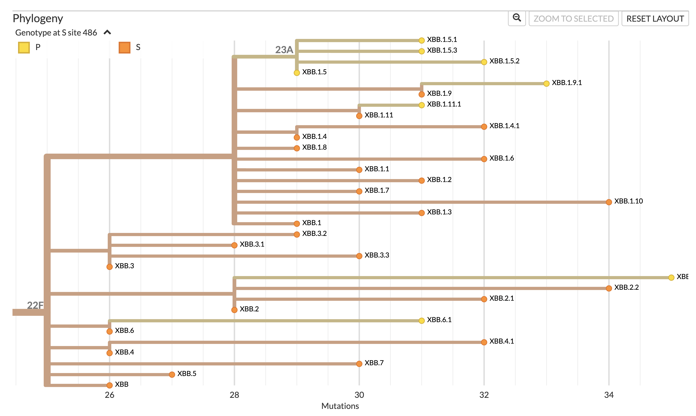

There are indications that XBB.1.5-like lineages are close to or already dominant in India, Indonesia and Malaysia, though with less than 100 sequences per week it is too early to be certain. Given that XBB has been much more common in those countries than in the USA, it is not unreasonable that some XBB.1.5-like lineages could have arisen and spread there before the US.

A covSpectrum collection for XBB.1.5-like lineages can be found here: https://cov-spectrum.org/collections/141

It is possible that different lineages will become dominant in different regions. Though this is probably only a matter of nomenclature as the functional behaviour is expected to be very similar.

In the rest of the world, except China, XBB.1.5-like lineages show similar growth advantages as seen in the US, although the uncertainty is high as the proportion and number of sequences from outside the US is still much smaller. It will be interesting to see how XBB.1.5 will fare in China where the immunological landscape is very different from the rest of world. So far, there is no sign of community circulation of XBB.1.5-like lineages in China - though given the relatively small number of sequences relative to its large population, it is not possible to rule this out.

## Potentially beneficial Spike mutations

It is unclear which direction the virus will move next, what Spike mutation or combination of mutations will end up providing the biggest fitness increase compared to current variants.

Jesse Bloom's immune escape and ACE2 binding calculator has been useful to recognize some trends early on, for example the beneficial immune escape provided by S:346T or the fact that S:486P strongly increases ACE2 binding compared to S:486S.

It is not unreasonable to use the calculator to look for the next beneficial Spike mutation. However, it is important to note that the calculator assumes that the mutations occur directly on BA.2, without the presence of the many other RBD-mutations that current variants have often acquired (like 346T, 356T, 444T, 486V/S/P, 490S). The more mutations there are, the less likely the predictions can be expected to be correct. That interactions between mutations (epistasis) is demonstrated by S:N460K which was not predicted to have a large benefit by the Bloom calculator, but has been found to emerge in all current variants, strongly suggesting it does provide a large benefit, at least in combination with other mutations.

Bearing these limitations in mind, there are currently three mutations that are predicted to be beneficial and are also commonly observed in practice:

Predicted to be beneficial for immune escape or ACE2 binding by Bloom lab (limitations: mutations right on BA.2 backbone, effects not necessarily additive with other RBD mutations already acquired, but at least sometimes still right, see 486P, counter example 460K much more beneficial than data suggests, also some mutations predicted to be beneficial but still don't happen or not until now): 
- S:A348S is predicted to significantly increase immune escape if added to BA.2, however given its close proximity to S:346T, it is possible that it does not provide any escape beyond that already effected by S:346T. S:A348SS is the defining mutation of DM.1, and has been observed in a number of other lineages. It does not appear to provide a big growth advantage at this point in time.
- S:Y453F is predicted to significantly boost ACE2 binding, however, whether that is the case in conjunction with other mutations like 493 reversion is unclear. S:Y453F has not been seen widely since the end of 2020. It is known to be a mutation that arose repeatedly in populations of minks. It is the defining mutation of the recently designated Pango lineage DN.1.1.1 (BQ.1.1.5.1.1.1).
- S:R403K is another mutation with predicted positive effect on ACE2 binding. It is one of the 2 defining mutations of DS.1 (BN.1.3.1.1), besides S:F490S which is predicted to decrease ACE2 binding. The combination could thus potentially be a successful combination.

If there was a single mutation that would provide large beneficial effects in BA.5 or BA.2.75, it would have likely become common by now, as can be seen with XBB which quickly acquired the beneficial 486P numerous times independently. Beneficial combinations, however, take a much longer time to evolve and are also harder to predict.

# Variant report 2023-01-19

## China

For the past month, China has been releasing around 200 sequences every week which is comparatively low. Using the number of recent sequences submitted per million inhabitants per month as a metric, China submits more than a 100 time less than large countries with high sequencing activity like US, UK, Japan, and 10x less than large countries with medium activity like Thailand, Indonesia, Brazil.

A fourth China specific lineage has been given a Pango designation: BA.5.1.32. As the other 3 China-specific lineages, it is a BA.5 derivative, and like BA.5.2.48 and BA.5.2.49, it does not carry a single additional Spike mutation known to cause immune escape beyond those already found in BA.5.

Sequences uploaded from China in the past two weeks are mostly BF.7.14 and BA.5.2.48, with BA.5.2.49 and BA.5.1.32 in the single digit percentage range.

Sequences from travellers arriving in Japan, South Korea, Taiwan, Singapore, France and Italy show a similar picture. BF.7.14 and BA.5.2.48 make up the bulk of the sequences.

As expected due to the non-immune-evasive nature of the lineages circulating in China, no large non-Chinese clusters of China-originating lineages have been detected so far. Any imports appear to cause only short transmission chains.

## XBB.1.5

XBB.1.5 continues to be the apparently fittest circulating lineage. It is already dominant on the US east coast and is projected to become so in the rest of the United States by mid February. In Europe, in samples collected in the first week of the new year, XBB.1.5 was responsible for around 1-5% of sequences, in the UK slightly above 5%. If the trend of a doubling time of around 10 days continues, XBB.1.5 is expected to be dominant in Europe by the end of February. Given competition from other lineages, it is however possible that XBB.1.5 will not perform a clean sweep.

## Other fit lineages

While XBB.1.5 appears to be the most competitive lineage at the moment, there are a number of lineages that are not at a big disadvantage:

- XBF (focal point Australia)
- CH.1.1 (focal points in New Zealand, UK)
- BQ.1* + S:346T + S:144- (very common in Denmark, France, UK)

# Variant report 2023-01-09

## 3 Chinese clusters given Pango lineage names

The 3 major Chinese lineages have now been given Pango names:

- **BA.5.2.48** is a BA.5.2 (on ORF1b:T1050N branch) with 4 additional silent nucleotide mutations: C2710T, C8626T, C16887T, T17208C; see designation issue [#1471](https://github.com/cov-lineages/pango-designation/issues/1471)
- **BA.5.2.49** is a BA.5.2 (on ORF1b:T1050N branch) with ORF1b:S997P, S:T883I and silent nucleotide mutation A14673G; see designation issue [#1480](https://github.com/cov-lineages/pango-designation/issues/1480)
- **BF.7.14** is a BF.7 (BA.5.2.1 with S:R346T) with extra S:C1243F, ORF1a:V274L, ORF1b:L238F, ORF7a:H47Y and silent nucleotide mutation C29632T; see designation issue [#1470](https://github.com/cov-lineages/pango-designation/issues/1470)

Pangolin and Nextclade dataset updates are underway to include these lineages.

All 3 lineages in their current form are unlikely to cause sustained community circulation outside of China because of pre-existing immunity.

BA.5.2.48 and BA.5.2.49 are "level 3" lineages which have been halving every 3 weeks in Europe and North America. In Europe, Level 3 (plain BA.4/5) peaked in Europe in July with 80% relative share. By the end of 2022, it was down to 4%, outcompeted by more antigenically advanced lineages (see [covSpectrum](https://cov-spectrum.org/explore/Europe/AllSamples/Y2022/variants?variantQuery=%5Bexactly-3-of%3A+S%3A346%2C+S%3A356%2C+S%3A444%2C+S%3A445%2C+S%3A450%2C+S%3A446%2C+S%3A452%2C+S%3A460%2C+S%3A486%2C+S%3A490%2C+S%3A494%2C+S%3A493Q%5D%26+%21+%28S%3A346-+%7C+S%3A356-+%7C+S%3A444-+%7C+S%3A445-+%7C+S%3A450-+%7C+S%3A446-+%7C+S%3A452-+%7C+S%3A486-+%7C+S%3A490-+%7C+S%3A494-%29+%26+%21nextstrainClade%3A21K) for details).

While BF.7.14 is expected to be more viable outside of China due to carrying the beneficial S:R346T, BF.7\* lineages have also been on a decreasing trend outside of China for more than 2 months. In Europe, BF.7\* peaked in October 2022 at ~15% and has since gone down to 3% by the end of 2022. It is currently halving in share every 4-5 weeks (see [covSpectrum](https://cov-spectrum.org/explore/Europe/AllSamples/Past2M/variants?nextcladePangoLineage=BF.7*&) for details).

The additional Spike mutations (S:T883I in BA.5.2.49 and S:C1243F in BF.7.14) are not expected to have a significant impact on the antigenic profile of the variants. As a result, the lineages circulating in China do not appear to be of concern outside of China. 

## New sequences from travellers from China

Japan's National Institute of Infectious Diseases has shared 35 new sequences from travellers from China with collection date in the last 2 weeks of 2022.  
Of the 35 sequences, 19 are BA.5.2.48, 16 are BF.7.14, 1 is BA.5.2.49 and 1 is a BA.5.2.1.

South Korea's CDC has shared 46 new sequences from travellers from China with collection date in the last 2 weeks of 2022.
Of the 46 sequences, 33 are BA.5.2.48, 8 are BF.7.14, 7 are BA.5.2.49, and 1 is BN.1.3

# Variant report 2023-01-06

## China

Sequences submitted from Chinese labs and labeled as `local cases` continue to fall almost exclusively into lineages BA.5.2 and BF.7.
No sequences with concerning mutation patterns have been submitted.

## XBB.1.5

XBB.1.5 is continuing to increase in frequency globally.
XBB.1.5 emerged from XBB, a recombinant of two BA.2 lineages (see [illustration](../images/XBB_recomb.jpg) by Emma Hodcroft), and is characterized by two additional mutations in Spike (G252V leading XBB.1, and the additional S486P in XBB.1.5).
Position 486 is already mutated in XBB from the ancestral `F` to `S`.
Similarly, position 486 is mutated to `V` in BA.5.
Mutations at this position contribute to immune evasion of antibody responses against BA.2 like variants, but most residues at this position reduce hACE2 binding.
The two-step change from `F` to `S` to `P` restores hACE2 binding while maintaining an immune evasive profile, see [Can Yua, Yunlong Cao and colleagues](https://www.biorxiv.org/content/10.1101/2023.01.03.522427v2).

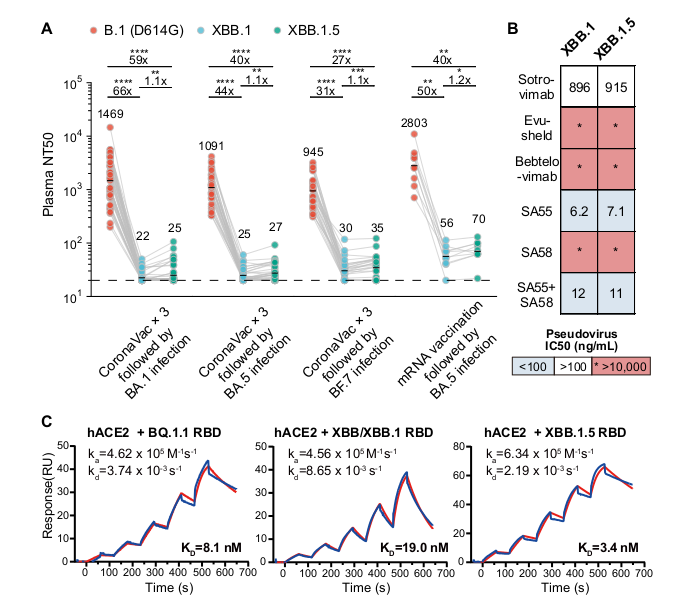 
*Neutralization titers and hACE2 binding affinities of XBB and XBB.1.5 variants. (Fig 1 from [Can Yua and colleagues](https://www.biorxiv.org/content/10.1101/2023.01.03.522427v2))*

XBB and descendants (22F in Nextstrain nomenclature) were dominant in South Asia earlier this fall and also contributed significantly to circulation in South- and Central America.
XBB.1.5 rose rapidly in frequency in the North East of the USA and has been dominating there since mid-December.
Outside of the North East of the US the variant is still sub-dominant, but increasing.

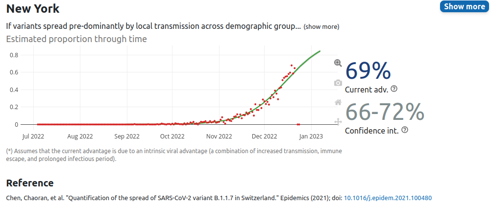 
*XBB.1.5 is dominating in New York and the logistic extrapolation puts its current frequency between 80% and 90%. See [Cov-Spectrum](https://cov-spectrum.org/explore/United%20States/AllSamples/Past6M/variants?nextcladePangoLineage=XBB.1.5) for up-to-date statistics based on data ub GISAID.*

In Europe, XBB.1.5 is still rare.
[CoV-Spectrum](https://cov-spectrum.org/explore/Europe/AllSamples/Past2M/variants?nextcladePangoLineage=xbb.1.5*&) currently lists 267 XBB.1.5 from Europe, corresponding to about 1% of all data submitted in the second half of December.
The frequency has been doubling roughly every week and if these trends continued we would thus expect around 3-6\% in the first half of January.
XBB.1.5 is observed across the continent with slightly higher proportions in the UK and the Netherlands.
As expected, phylogenetic analyses indicate many introductions of XBB.1.5.

There is little conclusive information on severity of XBB.1.5 compared to other circulating variants, but cases and hospitalizations have risen across the USA and not only in regions where XBB.1.5 is dominant.
This is an early tentative sign that the severity of XBB.1.5 infections is not substantially different from other current variants.

# Variant report 2023-01-02

## The surge in China is dominated by BA.5.2 and BF.7

 * **Circulation in China is dominated by BA.5.2 and BF.7**
 * **Sequences obtained from travellers from China support BA.5.2 and BF.7 as main variants**
 * **The BA.5.2 and BF.7 clusters from China have considerable diversity consistent with several months of circulation.**
 * **Isolated observation of other lineages might reflect global diversity sampled in Chinese quarantine facilities**
 * **No highly mutated sequences have been submitted**

Over the last two weeks, about 600 sequences with collection dates after Nov 1st 2022 from mainland China have been deposited in GISAID.
Some, in particular those from Shanghai are labeled as imported cases and are ignored here for the purpose of investigating diversity in China.
In addition to cases from China, about 100 sequences obtained from samples from travellers from China to Singapore, South Korea, Japan, Italy, or the US are available.
Taken together, these samples allow a rough assessment of the diversity of SARS-CoV-2 variants circulating in China.
Most of these samples are from Nextstrain clade 22B and more specifically Pango-lineages BA.5.2 and BF.7.

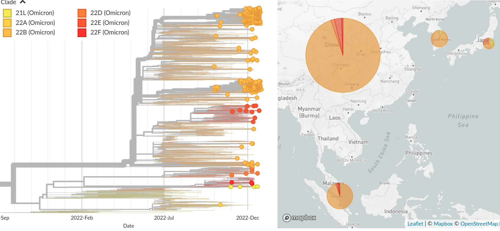
*Overview of samples from China. The two dense clusters are BA.5.2 (top) and BF.7 (middle).*

The top cluster in the above tree is Pango lineage BA.5.2.
The recent sequences suggest that at least two distinct clusters of BA.5.2 are circulating in China.
Both clusters are represented in Chinese data as well as in travel exports.
These two clusters have substantial diversity (sequences are around 5 mutations from the root of these clusters), suggesting they have circulated for several months.
But they remain very similar to global diversity and don't contain highly mutated sequences.
It is unclear whether their common ancestor was in China or whether these two cluster stem from separate introductions.

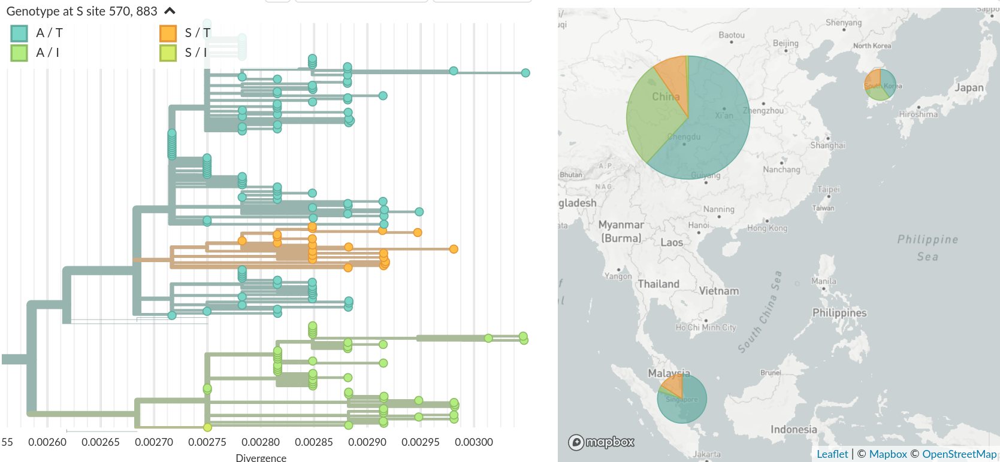
*BA.5.2 fall into two sublineages, one of which carried the mutation T883I in Spike (Green). The other lineages as branch with Spike mutation A570S (Orange).*

The other big group is lineage BF.7. Again, this lineage seems to have acquired substantial diversity in China in the last few months.
The most common mutation is Spike:C1243F.

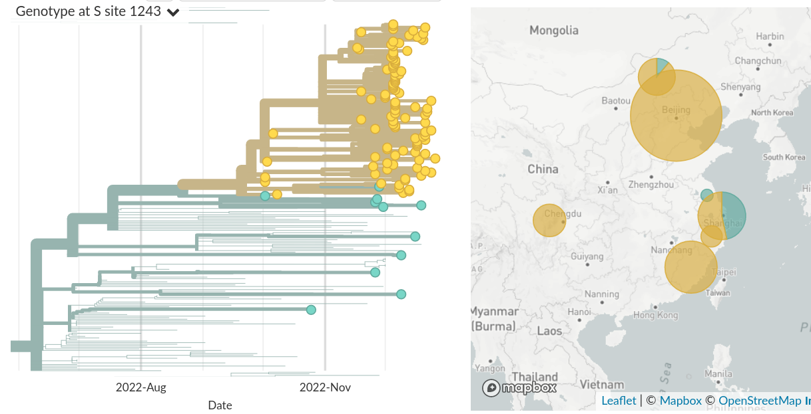
*BA.7 samples mostly come from a group with a mutation at spike position 1243.*

Both of these major BA.5.2 and BF.7 clusters are distributed across China.

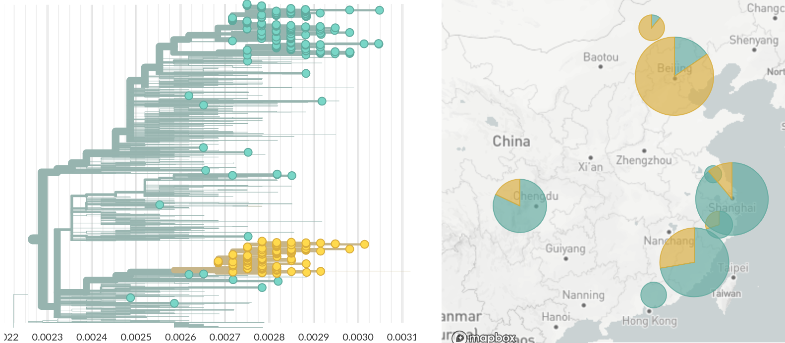
*Both groups (BF.7 yellow, BA.5.2 green) are distributed across mainland China.*

The remaining sequences tend to be isolated in the tree surrounded by global diversity.
They mostly come from Shanghai and Jiangsu.
The lineages they belong to are common globally (BQ.1.1, XBB, BN).
Many of those from Jiangsu originate from the *Nanjing Customs Port Outpatient Department*, which might imply these are samples from incoming travelers.
Similarly, not all samples from Shanghai incoming quarantine facilities might have been identified as such.

### Acknowledgements

The sequence data from China and the traveler data was generously shared via GISAID orginate the following laboratories

 * Shanghai Public Health Clinical Center, Fudan University
 * Fujian Provincial Center for Disease Control and Prevention
 * Beijing Changping Laboratory
 * National Public Health Laboratory, National Centre for Infectious Diseases
 * Sichuan Center of Disease Control and Prevention
 * Beijing Center for Disease Control and Prevention
 * Nanjing Customs Port Outpatient Department
 * Division of Infectious Disease Diagnosis Control, Honam Regional Center for Disease Control and Prevention, Korea Disease Control and Prevention Agency, KDCA
 * Guangdong Provincial Center for Diseases Control and Prevention
 * Laboratory of Microbiology, ASST SetteLaghi, Varese, Italy
 * SARS-CoV-2 testing team, National Institute of Infectious Diseases
 * Jinhua Center of Disease Control and Prevention
 * The Center for Disease Control and Prevention of Inner Mongolia
 * Division of Emerging Infectious Diseases, Bureau of Infectious Diseases Diagnosis Control, Korea Disease Control and Prevention Agency
 * Zhoushan Center of Disease Control and Prevention
 * Center Laboratory of Health Quarantine, Nanjing Customs District P.R. China
 * Hangzhou Center of Disease Control and Prevention
 * Northeastern LSTC
 * Center Laboratory of Health Quarantine, Nanjing Customs
 * The Center for Disease Control and Prevention of Hulunbeier
 * Ordos City Center for Disease Control and Prevention
 * Chifeng Centers for Disease Control and Prevention
 * Baotou City Center for Disease Control and Prevention
 * Chinese National Influenza Center, National Institute for Viral Disease Control and Prevention, Chinese Center for Disease Control and Prevention
 * Division of Laboratory Diagnosis Analysis, Jeju Branch Office, Honam Regional Center for Disease Control and Prevention, Korea Diseases Control and Prevention Agency

They were submitted by

 * Shanghai Institute of Hematology, National Research Center for Translational Medicine, State Key Laboratory of Medical Genomics, Ruijin Hospital Affiliated to Shanghai Jiao Tong University (SJTU) School of Medicine
 * Fujian Provincial Center for Disease Control and Prevention
 * Beijing Changping Laboratory
 * National Public Health Laboratory, National Centre for Infectious Diseases
 * Sichuan Center of Disease Control and Prevention
 * Beijing Center for Disease Control and Prevention
 * Division of Emerging Infectious Diseases, Bureau of Infectious Diseases Diagnosis Control, Korea Disease Control and Prevention Agency
 * National Institute for Viral Disease Control and Prevention, China CDC
 * Jiangsu International Travel Health Care Center, Center Laboratory of Health Quarantine
 * Zhejiang Province Center of Disease Control and Prevention
 * National Institute for Viral Disease Control and Prevention
 * Laboratory of Microbiology, ASST SetteLaghi, Varese, Italy
 * Pathogen Genomics Center, National Institute of Infectious Diseases
 * Center Laboratory of Health Quarantine, Nanjing Customs District P.R. China
 * Center Laboratory of Health Quarantine, Nanjing Customs
 * Ginkgo Bioworks Clinical Laboratory / XpressCheck
 * Chinese National Influenza Center, National Institute for Viral Disease Control and Prevention, Chinese Center for Disease Control and Prevention

# Variant report 2022-12-22

## XBB.1.5  grows fast, in New York state and globally

XBB.1.5 (XBB.1 + S:F486P), first mentioned in every report in this series since 2022-11-11 keeps growing fast and is predicted to be already dominant in New York state in samples collected on 2022-12-22. XBB.1.5 seems to grow by a factor of 2.2-2.5 every week (though these factors tend to decrease slightly as more data becomes available). A doubling per week compared to the average of circulating variants is still remarkable and on the order of Delta vs Alpha.

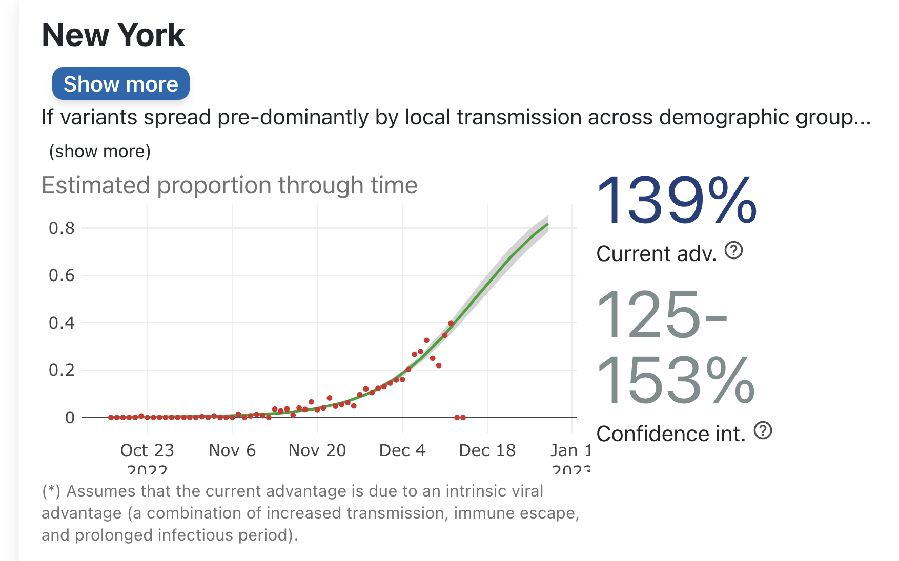
*Figure 1: Growth of XBB.1.5 in New York state*

The further one moves away from NY state, the less common XBB.1.5 becomes. In Connecticut, Massachusets & New Jersey, XBB is well above 20% at the time of writing. In California, it is around 5%.

Globally, outside the US, XBB.1.5 appears to make up around 0.5-5%. Even Canada does not seem to have much more than 1% yet. Less than 100 of the 1400 XBB sequences have been collected outside the US, so it is not yet possible to confirm the growth advantage in other countries.

Given the strong growth advantage that S:486P seems to confer in the XBB backbone, it is not unlikely that it arises independently - though at this point there is no clear evidence for such a lineage, yet.

## No recent sequences from mainland China, sparse traveler data

Given the reported surge in infections in mainland China, it is of particular interest what the circulating variants are. However, there is a total lack of recent sequences from community circulation in mainland China. The 15 sequences submitted to GISAID with collection date since 2022-09-01 are apparently from travellers to China, they are annotated as `Nanjing Customs Port Outpatient Department, Jiangsu International Travel Health Care Center, Center Laboratory of Health Quarantine`.

There are around 400 sequences from Huanan with collection date in August 2022. These are all BA.5.1.3.

Due to the lack of sequence submissions from China, the best information available is via sequences that have been annotated as coming from a traveler who had been to China - though it is not known with certainty that travelers actually got infected while in China.

Singapore has submitted 3 sequences with collection date in December 2022 that are annotated as `With travel history to China`. It is not certain that this means `mainland China` as Hong Kong, Macau and Taiwan could also be referred to as `China`. These sequences are BA.5, BA.5.1 and BA.5.2 respectively.

With collection dates in November 2022, there are 7 sequences uploaded from Singapore (3), Japan (3), South Korea (1). The lineages represented are:

- 3 x BA.5 (BA.5.1, BA.5.2, BA.5.6)
- 1 x BQ.1.22 (BQ.1 with S:R346T)
- 1 x XBB.1
- 1 x CH.1.1
- 1 x BA.2.3.20

For collection date October, the following lineages were reported in travelers: BA.5.2.20, BF.5, CM.3

These lineages are typical for circulation in Asia. It is interesting, though, that out of 13 sequences, BA.2.3.20* appears twice. BA.2.3.20 has only been found at above >5% in the Philippines. Yet, 13 sequences from travelers from China are too few to allow for any conclusions.

# Variant report 2022-12-15

## General picture

The trend of increasing diversification continues. BA.2 was the last variant that became nearly dominant all around the world.

Since then, different regions have had different distributions of variants. 22B (BA.5\*) got close to dominant in most regions except on the Indian subcontinent, where 22D (BA.2.75\*) took off before 22B got fully established.

22E (BQ.1\*) grew fast when it arrived in Africa, Europe and the Americas, but has recently culminated at between 25-75% share in Europe and North America.

22F (XBB\*) appears to have almost fixed on the Indian subcontinent, however, this is not true of other regions it spread to. 22F quickly grew to around 50% in Singapore but it has remained there at that level since.

22D (BA.2.75\*) has been growing in share compared to 22E (BQ.1\*) in Europe and North America, but it has not yet reached dominance.

Overall, there seems to be no clear winner. There appears to be an equilibrium of continuous antigenic evolution, that is:

- fast enough that there is a turnover of lineages every few months
- yet slow and homoplasic enough that
  - replacements cause moderate rather than dramatic waves
  - and that no single lineage dominates globally

For example, BF.7\* grew close to exponentially in Europe from first detection in May 2022 until September 2022, reaching a maximum of 12% share in Europe at the end of October. Yet, due to the evolution of fitter lineages, BF.7\* has since shrunk at an increasing pace to around 5% at the end of November. By the beginning of 2023, there will be not much BF.7\* left.

Without antigenic evolution, case numbers would hence be much lower than they currently are.

## Fastest growing lineages

- CH.1.1 (BA.2.75 + S:R346T, S:K444T, S:L452R, S:F486S)
  - Doubling every 1-2 weeks
  - Makes up around 5% of global sequences at the beginning of December.
  - Particularly common in New Zealand (~20%), Thailand (~10-20%), UK (~5-10%)
- XBB.1.5 (XBB.1 + S:F486P)
  - Doubling every week or faster
  - Makes up around 1% of global sequences at the beginning of December.
  - Particularly common in New York state (~10-20%) and the US east coast
- BQ.1\* + S:R346T + S:Y144-
  - Doubling every 2 weeks
  - ~10% of global sequences at the beginning of December.
  - Particularly common in Europe (~10-20%), only 2% in the US

## Lineages of interest

### XAY

XAY, a Delta-Omicron recombinant previously mentioned, has been circulating in South Africa at ~1-5% since June 2022, where it neither seems to disappear nor grow above that ~5%.
It was first detected in Denmark in September 2022 where it has been doubling every 2 weeks and now makes up 2% of all sequences in Denmark.
XAY has also been detected sporadically in increasing numbers in other European countries and globally.
What differentiates XAY from other growing lineages is that it has apparently not undergone any significant antigenic evolution in the Spike protein. Nonetheless, it has been growing at a steady pace in Denmark.
One possible explanation for this unusual behaviour may be that Denmark never had a significant BA.1 wave.

### BA.2.3.20

BA.2.3.20 is of interest as it appears to be rather different from the other major variants like BA.5\*, BA.2.75\* and XBB\*. It makes up around 1% of global sequences. Overall, it doesn't appear to grow, however, it has sublineages like CM.8.1 that *are* doubling at least every 2 weeks. Interestingly, RBD mutation S:G485D is very homoplasic in BA.2.3.20 while hardly seen in other variants. This may be due to epistasis with S:484R, which is defining for BA.2.3.20.

## Thoughts on S:F486P

The 2-step RBD mutation S:F486P, discussed previously, appears to confer a significant growth advantage on the order of ~50%/week, potentially larger than that of S:R346T seen in the past.

S:F486P is already present in many lineages (XBB.1.5, XBF/CJ.1, XAY, XBC, CH.3) and is otherwise reachable in one step for a large number of lineages in the BA.2.75\* and BA.2.3.20\* families, those with S:F486S.

In contrast, S:F486P is very hard to reach for lineages deriving from BA.4/5, requiring 2 steps, one of which is a rare G->C, since 486 is mutated to V in BA.4/5.
The shortest path from V to P goes via either L or A. L has globally only been observed 8 times with BA.5\* making this path very unlikely.
A on the other hand has been observed, most notably in BW.1.1 which makes up around 10% of sequences in Mexico (S:Y144-, S:K444T, S:N460K, S:F486A)
However, to get from A to P still requires the rare G->C mutation. And BW.1.1 notably lacks S:R346T.
This relative difficulty of reaching S:F486P for BA.5\* lineages may cause it to be outcompeted in the mid-term by BA.2.75\*, XBB\* and potentially BA.2.3.20\* or XAY.

# Variant report 2022-11-23

## Macro trends

Only a handful of broad variants and their descendants dominate global circulation.

### BA.5 (Nextstrain clade 22B)

BA.5 and its children is the dominant variant in Africa, Europe and the Americas where it is responsible for around 80% of infections. The fastest growing child lineage is BQ.1 (22E) in particular with extra mutations S:R346T and S:Y144- a combination that has arisen multiple times independently.

### BA.2.75 (22D)

BA.2.75 and child lineages is particularly common in South Asia (India, Bangladesh) where it accounts for between 20 and 80% of infections. The fastest growing child lineages are CH.1.1 and to a lesser extent CJ.1/XBF and BN.1.

### XBB (22F)

XBB can now be considered a separate macro variant due to its significant spread in South Asia (India, Bangladesh, Singapore, Indonesia) where it accounts for up to 80% of infections, depending on location. Antigenically mutated sublineages have emerged, most notably XBB.4 (S:K444R) common in Indonesia and XBB.1.5 (S:486P) which is growing on the US east coast.

### BA.2.3.20

BA.2.3.20 appears to be the dominant variant in the Philippines and has spread worldwide, making up between 0.5 and 5% of infections in most countries. It has independently evolved S:F486S multiple times, resulting in lineages that appear competitive (CM.2.1, CM.7, CM.8.1)

### XBC, XAY, BS.1

Besides remnants of BA.4 that are fast disappearing, three further variants are worth mentioning.

XBC is a Delta-Omicron recombinant that appears to be most common in the Philippines and Brunei, circulating at a prevalence of around 5%. Sublineage XBC.1 (S:L452M) has been rising in Australia to most recently 1%.

XAY is a Delta-Omicron recombinant that has been continuously circulating at low levels of around 1-3% in South Africa since first detection in June 2022. Sublineage XAY.2 seems to have established itself in Denmark as well, where it has been sequenced at least 30 times. It has been detected sporadically around the world, e.g. in the US, South Korea

BS.1 appears to have been close to being the dominant lineage in Vietnam. It has however hardly spread much beyond Vietnam.

## Convergent evolution of S:486P - a 2 step mutation

Spike substitution S:F486P has started to grow fast in recent weeks. It is distinctive by requiring two nucleotide substitutions: T23018C and T23019C. The transition from F to P has usually happened through the common intermediate S. It has evolved at least half a dozen times independently in a number of lineages: XAY, XBC, CJ.1 (= Spike donor of XBF), BA.2.10.4, XBB.1.5, CA.4.

Based on Jesse Bloom's ACE2 binding calculator, S:486P is predicted to significantly boost ACE2 binding affinity - which could explain the recent emergence, given that the intermediate has only recently been present in measurable numbers. Until June 2022, S:486S had only been sequenced 161 times, essentially background noise. Since June 2022, S:486S has been sequenced more than 14 thousand times.

## Lineages potentially worth studying in the lab

Among the many new lineages, a few stand out due to growth and spike mutations:

The following three have immediate potential for dominance:

- [BQ.1 + S:R346T + S:Y144-](https://cov-spectrum.org/explore/World/AllSamples/Past6M/variants?aaMutations=S%3AR346T%2CS%3A144-&nextcladePangoLineage=BQ.1*&): ~5% globally, doubling every week, found in multiple lineages: e.g. BQ.1.18, BQ.1.10/20/21/22/25
- [CH.1.1](https://cov-spectrum.org/explore/World/AllSamples/Past3M/variants?nextcladePangoLineage=CH.1.1*&): ~1% globally, doubling every week, extra Spike mutations S:R346T, S:K444T, S:L452R, S:F486S on top of BA.2.75
- [XBB.1.5, extra S:S486P](https://cov-spectrum.org/explore/World/AllSamples/Past3M/variants?nextcladePangoLineage=XBB.1.5*&): 43 sequences since first upload 7th of November, mostly US east coast, but 1x in Denmark/Switzerland each, too early to tell growth advantage but appears significant

The following four are interesting due to growth and being different from the above:

- [CJ.1/XBF](https://cov-spectrum.org/explore/World/AllSamples/from=2022-06-01&to=2022-11-30/variants?variantQuery=nextcladePangoLineage%3ACJ.1*+%7C+nextcladePangoLineage%3AXBF*&): Growing in Australia and Denmark, the spike of XBF is identical to CJ.1, extra S:486F->S->P, S:R346T, S:F490S on top of BA.2.75
- [XBC.1](https://cov-spectrum.org/explore/World/AllSamples/from=2022-06-01&to=2022-11-30/variants?nextcladePangoLineage=XBC.1&): Delta-Omicron recombinant that is growing in Australia, extra Spike mutation S:L452M on top of XBC
- [XAY.1](https://cov-spectrum.org/explore/World/AllSamples/from=2022-06-01&to=2022-11-30/variants?nextcladePangoLineage=XAY.1*&): Delta-Omicron recombinant that keeps circulating in South Africa, extra S:D253G on top of XAY
- [CM.8.1](https://cov-spectrum.org/explore/World/AllSamples/Past3M/variants?nextcladePangoLineage=CM.8.1*&): BA.2.3.20 with S:G446S and S:F486S, growing among others in Japan, California

# Variant report 2022-11-11

The general trend towards step-wise antigenic drift as opposed to evolutionary jumps continues. The same key mutations keep appearing in different lineages in new or identical combinations.

## BQ.1 diversity

Among BQ.1\*, most of the fastest growing lineages have acquired both S:Y144- and S:R346T. Both mutations have arisen multiple times independently. BQ.1.1 is the biggest sublineage that has S:R346T but it is by far not the only one. As a result it appears to be more useful to study haplotypes of BQ.1 sublineages rather than distinct lineages at this point.

Interestingly, S:144- appears to provide as much of a growth advantage if added on top of BQ.1 as S:R346T does.

Nowcasting haplotype prevalence (using the logistic fit from covSpectrum), S:346T is present in around 2/3 of all BQ.1\*. The deletion S:Y144- is present in around 30% of all BQ.1\*.

Both mutations together currently appear in around 15% of all BQ.1\* globally. The relative growth advantage of this haplotype compared to all BQ.1\* is around 5% per day which corresponds to a doubling time of around 2 weeks.

Within BQ.1.1, two level 8 lineages have recently been designated but it is too early to say how fast (if at all) they will grow. Both lineages notably lack the S:144- deletion.

- CZ.1 (aka BQ.1.1.1.1) with extra S:F490I has been sequenced in 4 countries, once each: England, South Korea, Austria and Romania and is predicted to be more immune evasive than BQ.1.1
- CW.1 (aka BQ.1.1.14) with extra S:G446S has been sequenced 8 times in England

## XBB still in the race

While it appears that BQ.1\* with S:144- and S:346T is growing faster in Europe and North America than XBB, it remains unclear whether the two variants could coexist in the mid term.

Some sublineages with interesting RBD mutations are:

- XBB.1.3 with A484T
- XBB.1.5 with F486P (XBB has F486S)
- XBB.4 with K444R
- XBB.4.1 with K444R and T470N

## BQ.1 + S:144- + S:R346T potentially fitter than XBB but co-circulation possible

It is still unclear BQ.1 + S:R346T + S:144- will fare against XBB* lineages.

In Singapore, where XBB has been dominant for a week weeks, XBB\* has stopped growing at around 2/3, the rest is made up of various BA.5 and BA.2.75 lineages. This could be a sign of immunity becoming more heterogeneous in the population which could give rise to co-circulating strains. But it is too early to tell with any degree of confidence. BQ.1\* is growing but still in single digit percentages.

BQ.1\* has been dominant in Nigeria for multiple weeks. However, sequencing is sparse and no XBB\* has been found there yet, so we cannot learn anything about cross-reactive immunity from there. Hence there is no country yet whose data can be used to learn about what significant BQ.1\* circulation could mean for XBB\*'s prospects.

## New lineages worth watching

There are a number of new sublineages that have a large predicted immune escape and sufficient ACE2 affinity as well as demonstrated growth advantage:

- CH.1.1 (aka BM.4.1.1.1.1 aka BA.2.75.3.4.1.1.1.1) has F486S, R346T, K444T, L452R in addition to BA.2.75 RBD mutations, it has appeared globally without clear origin [~150 sequences as of 2022-11-11]
- CJ.1 (aka BM.1.1.1.1 aka BA.2.75.3.1.1.1.1) has F486S -> S486P, R346T, F490S in addition to BA.2.75 RBD mutations [~30 sequences as of 2022-11-11]
- XBF, an Australian recombinant of BA.5.2.3 and CJ.1, with the RBD being that of CJ.1

# Variant report 2022-10-26

## Evolutionary trends within BQ.1.1 and XBB

It continues to be unclear which of BQ.1.1 or XBB will turn out to be fitter. There is still not enough data from countries with co-circulation, yet.

However, some evolutionary trends within BQ.1* and XBB are worth discussing.

### BQ.1* keeps acquiring beneficial mutations S:R346T and S:Y144-

Mutation S:R346T is not unique to BQ.1.1, it has been acquired independently in at least 2 other BQ.1\* sublineages: BQ.1.9 and BQ.1.18 which together make up less than 10% of all BQ.1\* with S:R346T.

Besides S:R346T, the other major mutation that seems to confer a significant growth advantage on a BQ.1\* backbone is S:Y144-. This deletion has been acquired independently at least a dozen times and seems to confer a significant additional growth advantage. Due to the large number of independent acquisitions, and the fact that Usher is blind to deletions, few Pango lineages defined by S:Y144- have been designated to date, the exceptions being BQ.1.18 and BQ.1.1.10.

Interestingly, relative growth advantage estimates conferred by S:144- seem to be higher when S:R346T is also present. While this could be a statistical artifact, it is also plausible that in the presence of S:R346T the remaining neutralizing antibodies bind particularly to the N-terminal domain which S:144- could disrupt.

In samples collected in early October, in BQ.1* *without S:R346T*, S:144- was present in ~15% of them, with relative growth advantage of S:144- of at around [3-5%/day](https://cov-spectrum.org/explore/World/AllSamples/Past2M/variants?variantQuery=nextcladePangoLineage%3ABQ.1*+%26%21+S%3A346T&variantQuery1=nextcladePangoLineage%3ABQ.1*+%26+S%3A144-+%26%21+S%3A346T&analysisMode=CompareToBaseline&).

In BQ.1* *with S:R346T*, S:144- was present in ~10% of them, with relative growth advantage of S:144- of at around [7-12%/day](https://cov-spectrum.org/explore/World/AllSamples/from=2022-09-01&to=2022-10-19/variants?variantQuery=nextcladePangoLineage%3ABQ.1*+%26+S%3A346T&variantQuery1=nextcladePangoLineage%3ABQ.1*+%26+S%3A144-+%26+S%3A346T&analysisMode=CompareToBaseline&).

With only 200 BQ.1* with S:R346T and S:Y144- in GISAID by 2022-10-26 there are no reliable growth advantages yet. This mutation combination seems to be particularly common in France and makes up a bit more than 1% of total sequences at the beginning of October.

Beyond BQ.1\*, the combination of S:144- and S:R346T has appeared in CR.1 (aka BA.5.2.18.1), BA.4.6.3, CQ.1/2 (BE.4.1.1.1/2) - all of which also have mutations at S:K444, as well as BS.1 (BA.2.3.2.1), BJ.1 (BA.2.10.1.1) and XBB.

### XBB sublineages with mutations S:G252V or S:D253G dominate

XBB.1 defined by S:G252V and ORF8:8\* (stop) makes up more than half of all recent XBB sequences. XBB.2 has independently evolved S:D253G and now makes up around 5% of all XBB sequences. The independent success of two mutations in such proximity is indicative of a growth advantage conferred by mutations at this position.

### Other BQ.1* and XBB lineages to monitor

Beyond the mutations and lineages mentioned above, some lineages with mutations of interest but small number of sequences are:

- BQ.1.1.11/12 with S:494P in addition to BQ.1.1-defining S:R346T
- BQ.1.1.2 with S:D253G in addition to BQ.1.1-defining S:R346T
- BQ.1.1.9 with S:S151I in addition to BQ.1.1-defining S:R346T
- XBB.1.3 with S:A484T in addition to XBB.1-defining S:G252V
- XBB.4 with S:K444R
- XBB.3.1 with S:Q677R

## Other lineages of interest with high predicted immune escape

Besides BQ.1\* and XBB, there are other lineages that are predicted to have high immune escape (by the Bloom et al. escape calculator):

- BN.1\* with S:A475V (1x Iceland, 1x Austria)
- BN.1.2.1 defined by S:T470N (19 sequences, mostly England)
- CH.1.1 (aka BM.4.1.1.1.1 aka BA.2.75.3.4.1.1.1.1), a level 7, with S:R346T, S:K444T and S:L452R and S:F486S in addition to BA.2.75-defining mutations, 47 sequences
- BQ.1.1 with S:G446S (2 clustered English sequences, level 7)

## 4-AA insertion N:211ins:SESF found in 900 BA.5.1.3 sequences

Ryan Hisner has noticed that a 4 amino acid insertion occurs in about 10% (that is 900 sequences) of the BA.5.1.3 lineage. However this insertion does not seem to confer a growth advantage. The insertion has been present at a stable ~10% of BA.5.1.3. See more details on the [pango-designation issue](https://github.com/cov-lineages/pango-designation/issues/1249).

# Variant report 2022-10-17

## Various immune evasive variants are dominant around the world

Various immune evasive variants have evolved around the world and are in the process of becoming dominant.

Due to a large degree of convergence, this time, it is not just one variant that goes around the globe - but different regions have different variants, depending on where a variant first arose.

Two variants stand out in particular: BQ.1.1 and XBB.

Both variants are found to evade neutralizing antibodies produced by vaccine and/or (breakthrough) infection. The best data at the moment comes from Yunlong Cao's group which keeps their preprint updated as new data is generated for novel lineages: <https://www.biorxiv.org/content/10.1101/2022.09.15.507787v3>.

Both variants notably evade antibodies produced after breakthrough infection with BA.5, see the figure:

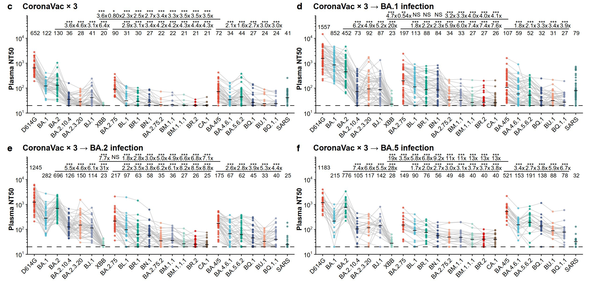
_Figure 1: BQ.1.1 and XBB evade antibodies produced after breakthrough infection with BA.5. Source: [@YunlongCao](https://twitter.com/yunlong_cao/status/1577343564572659712?s=20&t=rmsPt8YhfYSRW6-X2_8hsw)_

### BQ.1.1 not far from dominance in Europe and North America

BQ.1.1 is on the rise mostly in Europe and North America. It has a growth advantage of between 10-15%/day relative to its BA.5 ancestor, which corresponds to a doubling every week while the lineage is in the exponential phase of logistic growth.

BQ.1.1 was first sequenced in Nigeria, but given the low number of sequences from neighboring countries, the exact origins are not clear. In Europe, the country with the largest share of BQ.1.1 seems to be France, where it could make up around one third with sample dates mid October. In other European countries, the share at the moment is projected to be on the order of 5-20% in samples collected mid October.

In North America, BQ.1.1 is projected to make up around 10% of samples collected mid October.

With a doubling time of around one week, BQ.1.1 is on track to become the dominant variant in Europe and North America in the next 2-4 weeks. It is possible though that other similarly fit variants will grow similarly fast, which may lead to BQ.1.1 to stop growing before it reaches 100%. This however does not mean that the impact on infection numbers will be less, in contrast, if other variants grow as fast as BQ.1.1, the impact of infection numbers will happen sooner.

In Asia and Oceania, BQ.1.1 makes a smaller share of sequences, between 1-5%.

### XBB appears dominant in some countries in Asia

XBB was first detected in sequences from Singapore, India and Bangladesh. It is a recombinant of two second generation BA.2 (neither parent derives from BA.4/5): BJ.1 and BM.1.1.1 (BA.2.75.3.1.1.1).

BJ.1 never spread much worldwide due to not being competitive with other variants circulating at the time, e.g. BA.2.75 and BA.4/5 sublineages. It was most commonly found in Bangladesh where it seems to have peaked at around a third of sequences at the end of August. It was also detected in India, albeit only at a low share of around 2%.

BM.1.1.1 is a descendant of BA.2.75 with 3 key receptor binding domain mutations: S:R346T, S:F486S, S:F490S in addition to the ones BA.2.75 already contains. It reached the highest share in Bangladesh (around a third) and India (~2%) towards the end of August.

The geographic distribution of XBB's parents suggests that the recombination event happened in Bangladesh, India or neighboring countries that do not sequence much.

XBB has grown very fast on the Indian subcontinent and Singapore. It seems to be dominant in Bangladesh and Singapore already and makes up well above 10% of sequences in India, where it is expected to become dominant soon.

The growth advantage of XBB appears to be of the same order of magnitude as that of BQ.1.1, though the estimates are more uncertain due to less data being available and the recent emergence.

XBB has been detected in most countries around the world with a thousand or more sequences with collection date in the last month.

### How XBB and BQ.1.1 compare is not clear yet

Due to different regional foci of XBB and BQ.1.1, it is not possible to reliably compare whether one variant may be fitter than the other. Two scenarios are possible:
a) One variant may be fitter and outgrow the other globally
b) Both variants are similarly fit and antibodies against one variant do not protect as well against the other as against itself: in this case co-circulation is a possibility.

Countries to watch are in particular: Australia, Japan and South Korea, as they have a similar share of BQ.1.1 as of XBB. Data from these countries could show whether which variant grows faster when cross-immunity is not (yet) a factor.

Countries where one of the variants has become dominant, on the other hand, will allow to judge the degree of cross-immunity. The countries to watch for this are first and foremost Singapore where XBB is already dominant and which generates timely sequence data; and Europe/North America where BQ.1.1 is expected to become dominant and where XBB is also already present at around a 1%.

Furthermore, sera from people who have been infected with BQ.1.1 and/or XBB can be tested for cross-reactivity against the other variant.

Both XBB and BQ.1.1 have a significant number of differences in Spike, almost comparable to the difference with Delta:
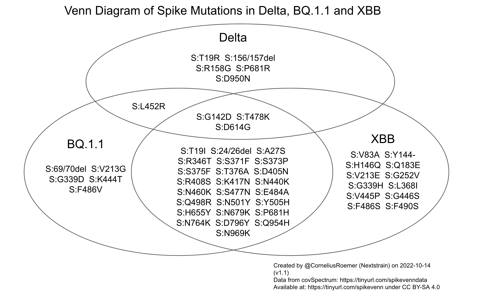

## Making sense of the variant soup by counting key mutations

It is important to bear in mind that BQ.1.1 and XBB are not the only variants that are growing in share around the world. There are many lineages with very similar mutation profiles that are growing almost as fast. These other lineages also contribute to variant driven case growth.

Evolution until recently has been mostly driven by singular variants that grew without similarly fit variants present. For example, when Alpha first emerged, it was the fittest variant by a good margin in Europe. Similarly with Delta, and BA.1, BA.2 and BA.4/5.

This time is different, it is no longer sufficient to consider a single variant when trying to predict when variants will start impacting case growth. It is necessary to consider the whole collection of fast growing variants.

One way to group variants is by counting the number of novel key mutations (in addition to BA.2's) in the receptor binding domain (RBD) that are known to lead to immune escape while not harming the virus's ability to bind to human cells at the ACE2 receptor. Since evolution in this area currently appears to be the most important driver of variant fitness, simply counting these mutations can be useful to broadly classify variants to get a sense of how common various levels of immune escape are in different countries and at different points in time.

The following list of key RBD mutations was derived from a combination of sources:
a) Jesse Bloom's immune escape calculator using data from Yunlong Cao's group
b) Observing which mutations often seem to arise in lineages with current growth advantage
c) Mutations that were commonly found in chronic infections as detected in waste water by Marc Johnson

The list is not perfect, the impact of a mutation is not binary, some are more important than others, but it is surprisingly effective at classifying variants with similar growth advantages:

- S:R346T/S
- S:K356T
- S:K444T/R
- S:V445P
- S:G446S
- S:N450D
- S:L452R
- S:N460K
- S:F486S/V/L/P
- S:F490S
- S:493rev
- S:S494P

Assigning different lineages to "levels" based on how many of these mutations they contain, leads to the following classification of some example lineages:

- Level 0: Stock BA.2
- Level 1: BA.2.12.1, and others with S:L452R/Q/M
- Level 2: BA.2.74, BH.1
- Level 3: Stock BA.4/5; BA.2.75; BA.2.77
- Level 4: BA.4.6, BF.7, BA.5.9; BA.2.75.5, BL.1, BL.2
- Level 5: BQ.1, BU.1, BW.1; BA.2.75.2, BM.1.1; BA.2.3.20, BJ.1, BS.1
- Level 6: BQ.1.1; BN.1, BM.1.1.1
- Level 7: XBB (BJ.1 x BM.1.1.1), CJ.1 (BM.1.1.1 with S:486P)
- Level 8: None designated yet

On covSpectrum, there is a collection that has pre-composed queries for these levels, so that it's easy to check how common variants with at least a certain number of key mutations are: <https://cov-spectrum.org/collections/54>

Plotting the share of variants with at least N mutations on that list looks like this for worldwide data:

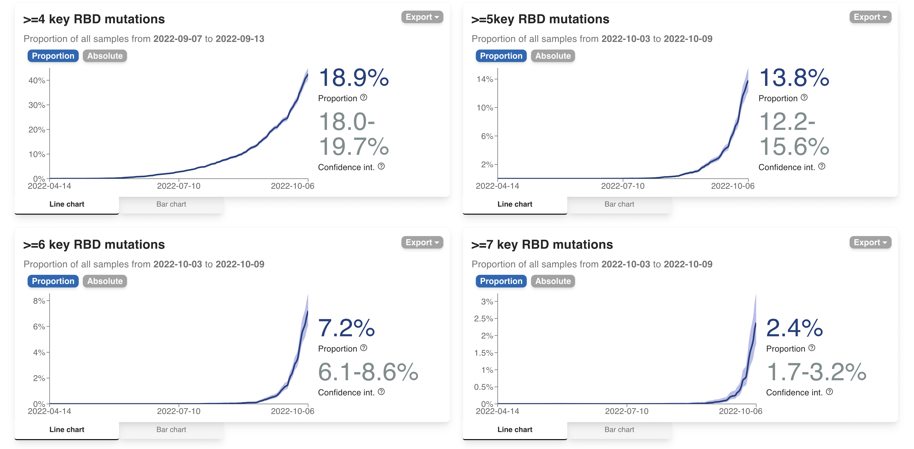
_Figure 2: Share of variants with at least N key mutations in the RBD worldwide, source: [covSpectrum collection 54](https://cov-spectrum.org/collections/54)_

The gist is: the more key RBD mutations, the faster the growth but the lower the share (as expectable, because anything with >= 5 mutations is automatically in the category of >= 4.

An alternative way to plot is to use exact counts of mutations. In that case, the curve can go down, as higher levels are not included in lower levels. This is what it looks like for 0-3 mutations:

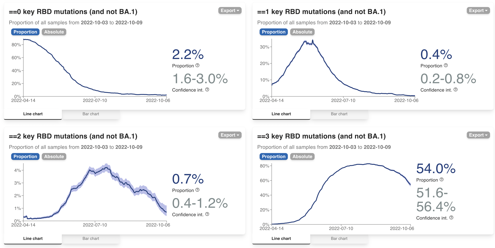
_Figure 3: Share of variants with exactly N key mutations in the RBD worldwide, source: [covSpectrum collection 54](https://cov-spectrum.org/collections/54)_

_Figure 4: Share of variants with exactly N key mutations in the RBD worldwide, source: [covSpectrum collection 54](https://cov-spectrum.org/collections/54)_

BA.2 (0 extra key RBD muts relative to BA.2) was dominant in April, but replaced by BA.2.12.1 (1 extra key RBD mut relative to BA.2 = S:L452Q). Variants with 2 extra mutations relative to BA.2 never became dominant because BA.4/5 (3 extra muts) arose and became dominant. Variants with 4 extra muts, e.g. BF.7/BA.4.6 (BA.4/5 with extra S:R346T) are now on the verge of becoming dominant but may get overtaken by varies higher level variants.

### Trend from long branch variants to step wise evolution and recombination

There seems to be a change in the main mode of evolution. Until recently, novel variants predominantly arose on long branches where intermediates were either not circulating or only at low levels, e.g. Alpha, Beta, Gamma, Delta, Omicrons BA.1/2/4/5, BA.2.75

Now, the main mode of evolution seems to be stepwise addition of receptor binding domain mutations. This has been observed now in both BA.2.75 (e.g. BA.2.75.2, BN.1, BM.1.1.1) and within BA.4/5 (BA.4.6, BF.7, BQ.1(.1), ...).

Interestingly, XBB is the first recombinant with a significant growth advantage, becoming regionally dominant, that has arisen from known parents. While various Omicron lineages likely involved some degree of recombination, this recombination could have occurred during the long branch phase, before the parents (donors) were in broad circulation.

It will be interesting to see if this trend continues, where stepwise evolution is the main mode, together with recombination between various step-wise evolved lineages.

In contrast to long branch variants and recombination, step wise evolution is more predictable. Since recombination, which is more stochastic, seems to remain important, at least for the time being, there remain uncertainties in the evolution of SARS-CoV-2.

## Non-RBD mutations may play an increasing role

The main difference between BQ.1.1 and XBB seems to be in the number of non-terminal domain (NTD) mutations that XBB has (due to being partially derived from BJ.1 which had many mutations there).

There seems to be an increasing selection pressure for NTD mutations, though there seem to be a broader range of sites at which these mutations can be beneficial, e.g. around positions S:248-253, around S:210, and around S:140-160. In particular, the S:Y144- deletion seems to arise frequently in BQ.1.1 and other recent lineages and could potentially provide an additional growth advantage.

It is plausible that with the RBD evolving to escape neutralizing antibodies, the NTD will become a relatively more important target for neutralizing antibodies - which in turn could lead to increased selection pressure for NTD mutations.

There is also evidence that mutations outside of Spike play a role. However, there has been less systematic analysis of these mutations to date.

## Growth advantage estimates and variant share projections

Tom Wenseleers and Moritz Gerstung continue to update their growth advantage estimates for novel variants. Models from both scientists show that BQ.1.1 has a growth advantage above 10% per day. Moritz Gerstung further showed that the recent infection wave in Germany was not (yet) driven by novel variants and that a significant contribution of variants to case growth is yet to come until end of November (for Germany).

See their threads for more details:

- Moritz Gerstung's with estimates based on German data: <https://twitter.com/MoritzGerstung/status/1580222575866564608?s=20&t=Pfphgp0lMBhomNZhS_NaVw>
- Tom Wenseleers' with estimates based on global data: <https://twitter.com/TWenseleers/status/1580701680840024065?s=20&t=Pfphgp0lMBhomNZhS_NaVw>

# Variant report 2022-09-28

## BQ.1 has kept doubling every week, may become dominant by the end of November

BQ.1, a BA.5 sublineage with S:444T and S:460K, continues to grow fast and is on track to become the dominant lineage in Europe in samples collected by the end of November. Two weeks ago, there were just 119 sequences in GISAID, collected world wide. Today, on the 29th of September, there are already 692.

It is plausible that the daughter lineage BQ.1.1 with additional S:346T will grow even faster. Samples in GISAID have gone up from 29 two weeks ago to 213 as of today.

The relative growth rate of BQ.1 in the current BA.5 background is on the order of a doubling in share every week. BQ.1 made up around 1% of samples collected in Europe and North America in the middle of September.

BA.2.75's various sublineages, including BA.2.75.2, continue to show a substantial growth advantage over circulating BA.5 - however, BQ.1 appears to grow faster. In Europe and North America, the proportion of BA.2.75\* and BQ.1 is already roughly similar, despite BA.2.75\* having been present two months earlier. In Asia, there is still much more BA.2.75\* than BQ.1.

Tom Wenseleers calculates a growth advantage over BA.5.2 of just below 14% per day for BQ.1, whereas BA.2.75.2 comes in lower at around 9% per day. This is consistent with BQ.1 doubling in share every week.

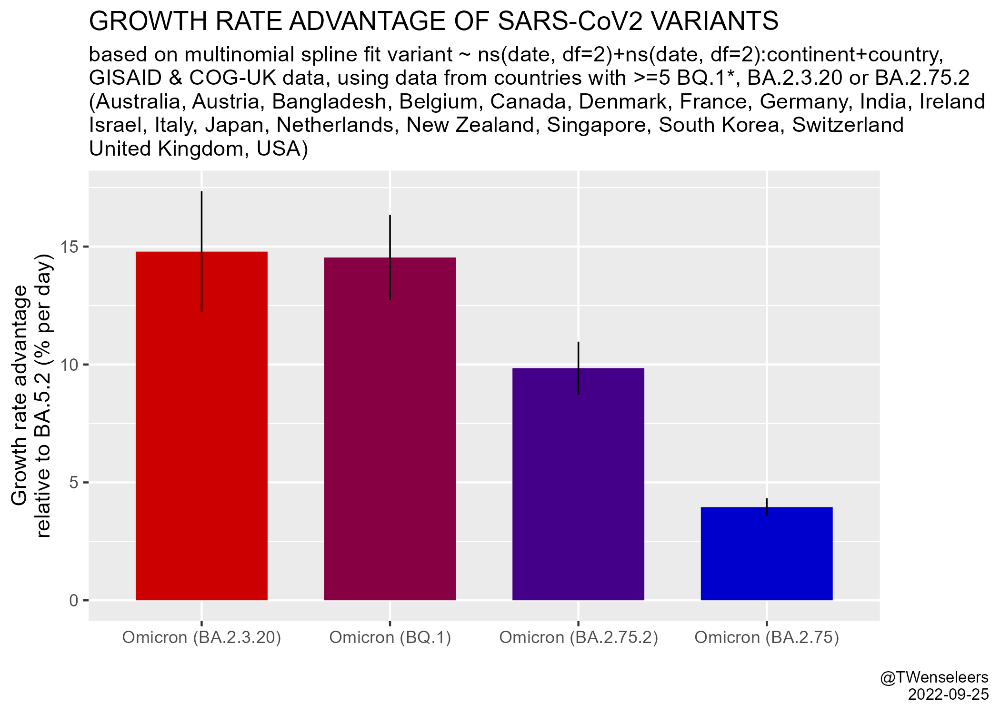

(from <https://twitter.com/TWenseleers/status/1574070423175966720?s=20&t=bNy5CvKmfDwXOIhIVB6z5g>)

There are other members of the BA.2.75\* family that could still outcompete BA.2.75.2 but the data is too scarce at this point to draw conclusions. One candidate is BN.1 which has the immune escape substitution S:356T in addition to the S:346T shared with BA.2.75.2.

Based on recent data from Nigeria, BQ.1 seems to have become dominant there at the end of August.

## Other new variants of interest

As mentioned in previous reports, the same mutations keep arising independently. This report can only focus on the lineages that appear to show the highest growth advantage and are present in the largest numbers at this point.

BA.2.3.20, a variant that seems to be most common in an under sampled area in South East Asia, keeps growing at a similar pace as BQ.1, albeit with lower absolute numbers to date. On GISAID there are 142 today with doubling time of uploads of about a week, similar to BQ.1. In Tom Wenseleer's analysis (see above), BA.2.3.20 has a similar growth advantage as BQ.1.

Another lineage to keep an eye on is the recombinant XBB, which has BJ.1 and BM.1.1.1 (a BA.2.75\* lineage) as donors with a breakpoint in the middle of the RBD (around S:450-460). The first sample was uploaded to GISAID on the 11th of August. Today there are already 50 sequences. It appears to be most common in Bangladesh and the East of India. With such low numbers, doubling times are hard to estimate.

Very recently, a Delta(21I)-BA.2 recombinant designated as XBC has been sequenced multiple times in the Philippines and also globally in the US, Austria and South Korea. With just 12 sequences to date, all uploaded since the 20th of September, it is too early to say whether this lineage will be able to compete.

The "Great Convergence" of similar mutations arising independently has been illustrated well by Marc Johnson:

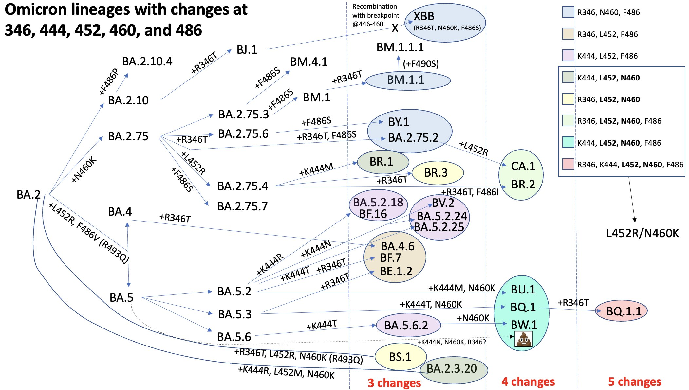

(from <https://twitter.com/SolidEvidence/status/1574040436204871680?s=20&t=bNy5CvKmfDwXOIhIVB6z5g>)

## BA.2.75.2 and other novel lineages show significant immune escape

Yunlong Richard Cao has shared a vast amount of experimental data on neutralization titers and ACE2 binding affinities for most of the lineages mentioned in this report. BA.2.75.2 appears to be the most immune evasive to date, with BQ.1(.1) also showing significant escape:

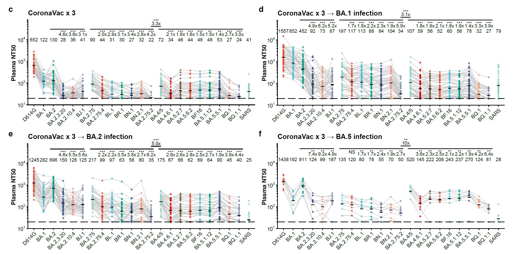

Unfortunately, BQ.1.1 escapes both evusheld and bebtelovimab:

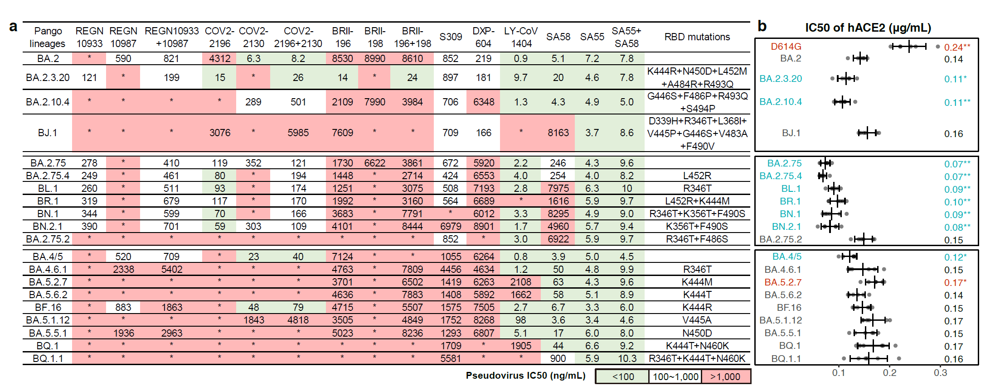

For more details see their preprint: <https://t.co/itJGuLfW3y>

# Variant report 2022-09-14

## A variant wave is likely to start in at most 3 months

The BA.2.75 sublineage BA.2.75.2 (S:346T, S:486S, S:1199N) currently doubles in share every week (+80-120%). It made up between 0.1 and 0.5% in samples from two weeks ago in Europe (in Asia, North America and Oceania, the share is higher at between 0.5-5%).

- [Global Cov-Spectrum query](https://cov-spectrum.org/explore/World/AllSamples/Past6M/variants?nextcladePangoLineage=BA.2.75.2*&)
- [Europe Cov-Spectrum query](https://cov-spectrum.org/explore/Europe/AllSamples/Past6M/variants?nextcladePangoLineage=BA.2.75.2*&)

If this growth trend continues, this variant will dominate in about two months.
At this point, the growth advantage would manifest in increased overall growth in incidence and a variant wave would start around November - on top of the expected seasonal acceleration of transmission.

The growth advantage over resident BA.2 or BA.5 lineages is of the same order of magnitude as was the case when  BA.5 displaced BA.2, which was sufficient to cause a summer wave.

Currently, BA.2.75.2 is the fastest growing lineage with more than 350 sequences available. The rest of this report will focus on other lineages that may end up growing faster than BA.2.75.

## BQ.1 - a BA.5 descendant - may outcompete BA.2.75.2

For a while it appeared as if S:346T was the major beneficial mutation that BA.5 could pick up. BQ.1 shows that this is not the case.

BQ.1 stands for BA.5.3.1.1.1.1.1. It has two RBD mutations on top of BA.5's: S:K444T (defining BA.5.3.1.1.1.1 or BE.1.1.1) followed by S:N460K (defining BQ.1 alias for BE.1.1.1.1). BQ.1 is notable in that it has picked up beneficial mutations in a step wise manner (as is evident in the long Pango name). In contrast to BA.2.75 and other 2nd generation BA.2, it does not lie on a long branch.

BQ.1's parent BE.1.1.1 was most commonly detected in Nigeria as early as July. It is also Nigeria where BQ.1 was first sequenced. It is important to note that sequencing activity in West African countries neighbouring Nigeria is very low so that Nigeria is not necessarily the country of origin - reminiscent of the situation with South Africa and Omicron.

On the 14th of September 2022, 119 sequences BQ.1 sequences had been uploaded to GISAID. The most recent 50 in just the last 3 days. The most recent 100 in just the last 9 days. This is suggestive of a large growth advantage that is difficult to estimate precisely but of similar magnitude to BA.2.75.2.

Importantly, BQ.1 has already picked up S:R346T in a lineage called BQ.1.1, which plausibly increases the growth advantage further. 26 out of 29 sequences of BQ.1.1 have been uploaded in the past 7 days.

It is possible that BQ.1 or BQ.1.1 may outcompete BA.2.75.2, which could result in co-circulation of multiple lineages during a wave or double peak waves as seen with BA.1 or BA.2.

## S:N460K emerged in multiple new lineages

A mutation that both BA.2.75 and BQ.1 have in common is S:N460K. This mutation is also present in two 2nd generation BA.2 variants: BA.2.3.20 and BS.1 (=BA.2.3.2.1).

BA.2.3.20 was first mentioned in last fortnight's report. On top of the BA.2 spike mutations it has: S:M153T, S:N164K, S:H245N, S:G257D, S:K444R, S:N450D, S:L452M, S:N460K S:E484R and the typical S:R493Q reversion.

To date, there are 20 sequences on GISAID, of which 13 have been uploaded in the past 7 days. The first sequence was uploaded 16 days ago. This is suggestive of a large growth advantage, that cannot however be estimated to allow comparison with BQ.1 and BA.2.75.2.

A lineage called BS.1 (=BA.2.3.2.1) has recently been detected in travellers to Japan coming from Vietnam. To date there are 5 sequences of this lineage in GISAID. In addition to the S:R493Q, additional spike changes relative to BA.2 are: S:Y144-,S:G257V,S:R346T,S:L452R,S:G476S,S:N460K,S:S640F.

BJ.1 and BA.2.10.4, two 2nd generation BA.2 mentioned 4 and 6 weeks ago, appear to have growth advantages that don't exceed ordinary BA.5 by much and are hence do not appear of concern regarding dominance - at least as long as they do not pick up further mutations.

# Variant report 2022-08-31

## BA.2.75 is rapidly picking up multiple beneficial spike mutations

It increasingly looks like BA.2.75\* may dominate even the fittest BA.5\* lineages because it is picking up beneficial spike mutations at a faster rate. While the BA.2.75\* founder virus itself could be less fit than the fittest BA.5\* sublineages like BF.7\* (BA.5.2.1 with S:R346T), BA.2.75 has rapidly picked up multiple beneficial spike mutations.

In particular subsets of the following S1 mutations have been picked up by various lineages that have arisen from the BA.2.75 polytomy:

- S:R346T (defining mutation of BL.1=BA.2.75.1.1, one of 3 defining mutations of BA.2.75.2, very homoplasic, growth advantage: 4-8%/day)
- S:K356T (defining mutation of BA.2.75.5, growth advantage: 5-10%/day)
- S:F486S (one of 3 defining mutations of BA.2.75.2, appears homoplasically in BA.2.75.3, growth advantage: 5-10%/day)
- S:D574V (defining mutation of BA.2.75.1, growth advantage: ~3-4%/day)

While the growth advantages of the above mutations on their own are roughly in line with growth advantages conferred in BA.4/5 sublineages, what makes BA.2.75\* different from BA.4/5\* is that BA.2.75\* is picking up multiple beneficial spike together.

The evolution of BA.2.75* is convergent to BA.4/5 as BA.4/5 itself has S:F486V and has repeatedly picked up S:R346T. By analogy, there is thus some hope that the repertoire of beneficial mutations is more or less exhausted by the above mutations.

## Sublineages of BA.2.75 to watch

The following sublineages of BA.2.75 deserve attention as they are the most obvious candidates to become dominant in the next few months (BA.2.75 has comparative fitness to BA.5*):

- BA.2.75.2 (S:346T, S:F486S, S:D1199N): growth advantage over BA.2.75 (~10-15%/day)
- BL.1 (S:D574V, S:R346T): growth advantage over BA.2.75 (~5-10%/day)
- BA.2.75.3 (S:K356T): growth advantage over BA.2.75 (~5-10%/day)

A growth advantage of 10%/day means it takes ~6 weeks from 1% share to 50%, (5%/day -> ~3 months, 3% -> ~5 months), if the growth advantage of the above lineages hold up, BA.2.75\* could become dominant globally (including Europe) by the end of October.

The figure below shows how BA.2.75\*with at least two out of the 4 mutations mentioned in the first section is growing fast in comparison to all BA.2.75\*, within 1 month from first observation, these lineages have grown to >10% of BA.2.75*:

## Recommended tool to monitor the latest designated lineages

The volunteer Federico Gueli maintains a very helpful covSpectrum collection of recently designated lineages, including the candidates for dominance at:
<https://cov-spectrum.org/collections/24>

It is suggested to sort the list descending by `CI (low)` to counter the bias of new lineages having inflated growth advantage estimates.

By default, the growth advantage is relative to all sequences - but the baseline can be changed to e.g. BA.5*, or BA.5* & S:346T.

The region can be chosen as desired, for example Europe, to focus on what happens locally.

Here is the table with worldwide data and baseline BA.5*\

## Spike mutations that seem to confer growth advantages to BA.5

Given that the variant surveillance community tries to designate all lineages with significant growth advantages, the defining mutations of recently designated lineages can be taken as a proxy for mutations that seem to confer growth advantages to BA.5. The following mutations show up repeatedly:

- S:R346T (most prominently in BA.2.75.2, BL.1, BA.4.6, BF.7, BF.11, BE.1.2, BA.5.2.6)
- S:R346S (most prominently in BA.4.7, BF.13)
- S:444M (BA.5.2.7)
- S:444T (BE.1.1.1, BA.5.6.2)
- S:444R (BF.16)
- S:450D (BA.5.5.1, BF.14)
- S:1020S (BF.3.1, BF.5)

Currently, there does not seem to be much space for BA.4/5* to move beyond picking up S:346T or similar single mutations. This makes it more likely that BA.2.75 or another yet unknown sublineage of BA.2 will become dominant in the next few months.

## Recent Pango proposals of interest

### South East Asian BA.2.3 sublineage with 10 convergent S1 mutations

Ryan Hisner has proposed a highly S1 mutated BA.2.3 sublineage that appears to be have its origin somewhere in South East Asia, possibly Malaysia or Indonesia: <https://github.com/cov-lineages/pango-designation/issues/1013>

It is unfortunately not (yet) possible to tell the growth advantage of novel lineages just from looking at the Spike profile if there are so many of them. But the simultaneous discovery on 3 continents with collection date <2 weeks ago and low diversity are what one would expect to see from a lineage with high growth advantage. This should be monitored.

# Variant report 2022-08-17

## S:R346T confers significant growth advantage to BA.4/5, projected to become dominant in October

BA.4 and BA.5 lineages that have the S:R346T substitution continue to grow faster than their siblings without the substitution. (S:R346K was the defining mutation of BA.1.1 that became dominant in a large number of countries before BA.2 took over)

The substitution S:R346T and related ones to I, S and K have appeared numerous times independently in BA.4 and BA.5. These are the ones designated by Pango thus far:

- BA.4.6 (T)
- BA.4.1.8 (T)
- BA.4.7 (S)
- BF.7 (T, alias for BA.5.2.1.7)
- BF.11 (T, alias for BA.5.2.1.11)
- BF.13 (S, alias for BA.5.2.1.13)
- BE.1.2 (T, alias for BA.5.3.1.2)
- BA.5.9 (I)

While BA.4.6 is the single most common BA.4/5 lineage with S:346, it has a growth disadvantage compared to BA.5 lineages with the same mutation, due to the fact that BA.4 has a general growth disadvantage against BA.5. This is immediately evident considering that BA.4\* started out slightly more common than BA.5\* in April 2022 it is now more than 10 times less common.

Globally, BA.5 with S:R346T is expected to become more common than BA.4 with S:R346T in sequences from this month - although there are naturally regional variations. For example, in Belgium BA.5 with S:R346T is already much more common than BA.4 with S:R346T while in the US the BA.4 lineages are still more frequent.

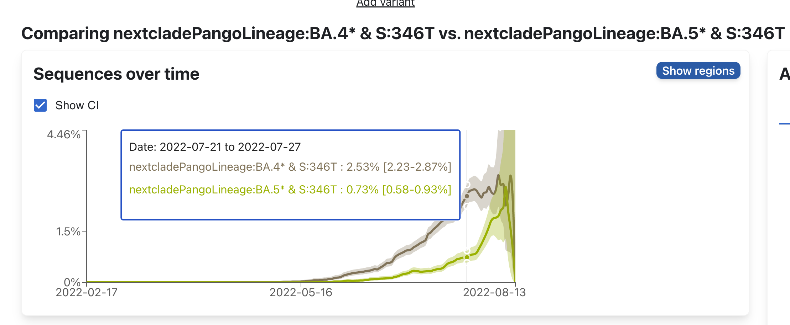
_Figure 1: BA.5 with S:R346T is overtaking BA.4 with S:R346T on a global level, source [covSpectrum](https://cov-spectrum.org/explore/World/AllSamples/Past6M/variants?variantQuery=nextcladePangoLineage%3ABA.4*+%26+S%3A346T&variantQuery1=nextcladePangoLineage%3ABA.5*+%26+S%3A346T&analysisMode=CompareEquals&)_

If evolution was frozen with only existing lineages, BA.5 + S:346T would be expected to become the dominant variant approximately in October 2022. BA.5 + S:346T made up around 1% in European countries at the end of July.

Of course, other fitter lineages, be it sublineages of BA.4/5, of BA.2 (e.g. BA.2.75) or other variants may evolve at any time so these projections need to be read with appropriate caution.

## BA.2.75 now dominant in India, has acquired extra spike mutations in some lineages

### Global spread of BA.2.75

BA.2.75 has continued growing in share in India and has been dominant since the end of July, despite the presence of BA.5.

Other countries where BA.2.75 has established itself at levels >1% at the beginning of August are:

- Nepal (>50%)
- Singapore (~10%)
- Australia (~2%)
- Japan (~1%)

While BA.2.75 is most common in Asia and Oceania, its share is increasing in all countries that have submitted large amounts of recent sequences. However, the share of BA.2.75 in Europe and North America is too small (~0.1-1%) to be able to confidently compare growth advantages of BA.2.75 and the fittest BA.5 lineages.

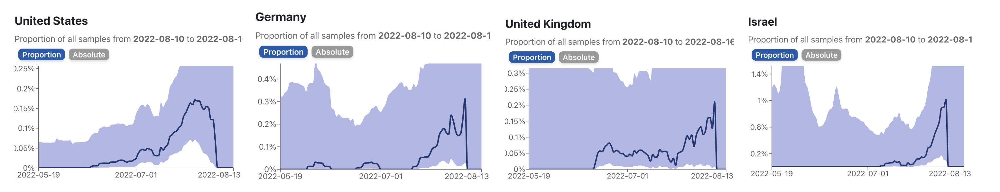

### Extra spike mutations in BA.2.75

With more than 3000 sequences of BA.2.75 available, it is now possible to analyse intra-lineage diversity. Due to challenging sequence quality, only 1 sublineage has been designated so far (BA.2.75.1 with S:D574V).

BA.2.75 with S:D574V, designated as BA.2.75.1, is apparently increasing in share making up ~40% of recently uploaded BA.2.75\*. Based on relatively noisy data, BA.2.75.1 seems to have a growth advantage of ~4-6% - corresponding to a doubling in share every 2-3 weeks. This lineage is not localized in any particular country and has been detected in most places that have sequenced BA.2.75. S:574 substitutions have only rarely been observed in the pandemic thus far - usually as S:D574Y in a handful of Delta sublineages in countries like Portugal, France and Denmark. In more than 12 million sequences, S:D574V has occurred less than 200 times outside of BA.2.75.

Maybe unsurprisingly, BA.2.75\* has already independently acquired S:346T twice, once in BA.2.75, once in BA.2.75.1. With less than 100 BA.2.75 + S:346T sequenced to date, it is too early to estimate the growth advantage (or disadvantage) this mutation might confer - but it is not unlikely to be of similar magnitude as in BA.4/5*. S:346T is present in around 3% of all BA.2.75\*.

Other notable spike mutations detected internationally and at least ~15 times (i.e. in >0.5% of BA.2.75\*) are:

- S:K356T (~1%)
- S:L452R (~0.5%, known from Delta)
- S:F486S (~1%, similar to S:F486V known from BA.4/5)

Even if no other novel variant evolves, the large number of sublineages that have arisen and will arise in BA.5 and BA.2.75 make it difficult to predict with confidence whether a BA.5 or BA.2.75 lineage becomes dominant in Autumn/Winter in Europe. Both outcomes seem possible though BA.5 has a considerable head start - being the currently dominant variant in Europe.

## Developments outside of BA.4/5 and BA.2.75

Some of the novel lineages that have been discussed in the previous report have recently been designated:

- BA.2.10.4: BA.2.10 + W64R, 141-144del, 243-244del, G446S, F486P, R493Q, S494P, P1143L ([Pango issue #898](https://github.com/cov-lineages/pango-designation/issues/898))
- BA.2.38.2: BA.2.38 (=S:417T) + 157S, 444N ([Pango issue #828](https://github.com/cov-lineages/pango-designation/issues/828))
- BA.2.38.3: BA.2.38 (=S:417T) + 69/70del, 71F, 452Q, 446S, 478R, 1264L ([Pango issue #840](https://github.com/cov-lineages/pango-designation/issues/840))

In addition, the following recently designated lineage is of interest due to its large number of Spike mutations:

- BJ.1: BA.2.10.1 + S:V83A, H146Q, Q183E, V213E, G339H, R346T, L368I, V445P, G446S, V483A, F490V, G798D, S1003I ([Pango issue #915](https://github.com/cov-lineages/pango-designation/issues/915))

None of these seem to show rapid growth but it is too early to exclude the possibility that they may be or become competitive with BA.4/5 and BA.2.75.

# Variant report 2022-08-03

## BA.2.75 outcompetes BA.5 in India

BA.5 continues to dominate in all countries with recent sequences apart from India/Nepal where BA.2.75 is becoming dominant.

As of 2022-08-03, there are around 1400 sequences of BA.2.75 on GISAID, almost 3 times as many as 14 days ago.

In India BA.2.75 has a large growth advantage over its ancestor BA.2 (16-17%/day) and a modest growth advantage over BA.5 (4-6%) as shown by [Tom Wenseleers](https://twitter.com/TWenseleers) using a hierarchical regression model that has performed well with past variants. For countries outside of India sequence numbers are still too small to distinguish conclusively between growth due to important and intrinsic growth advantage.

To put this into context, for BA.2.75 to grow from 0.1% to 50% in a background of BA.2 it would take around a month (this is approximately what is happening in India). In a background of BA.5, assuming growth advantages globally are the same as in India, it would take BA.2.75 about 3 months to grow from 0.1% of all sequences to 50%.

So while BA.2.75 seems to start driving a wave as visible in positivity rate attributed to variants, any potential BA.2.75 wave in e.g. Europe is still 2-3 months away and would be much less drastic than the wave caused by BA.1 vs Delta (~20% daily growth advantage), BA.2 vs BA.1 (~10% daily growth advantage) and BA.4/5 vs BA.2 (~10% daily growth advantage). Of course, it is possible that the BA.2.75 growth advantage vs BA.5 is India-specific and/or that another variant will evolve (either from BA.2, from BA.5, even BA.1 or non-Omicron) so that there will never be a BA.2.75 wavelet.

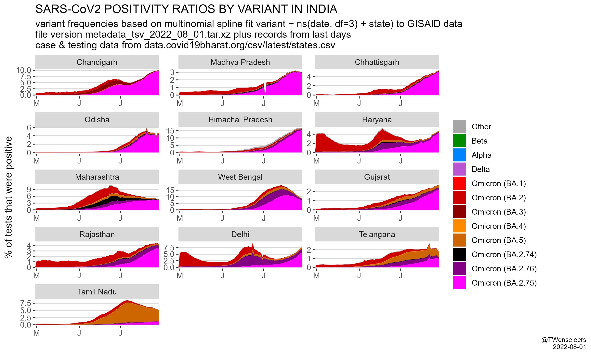

[Cov-Spectrum link with BA.2.75 in India](https://cov-spectrum.org/explore/India/AllSamples/Past3M/variants?variantQuery=NextcladePangoLineage%3ABA.2.75)

[Link to Twitter thread with figures](https://twitter.com/TWenseleers/status/1554189987586908161)

## Intra-Omicron recombinants keep appearing but so far with limited growth advantages

Recombinants containing BA.4/5-Spike have been identified recently but until now, no identifiable recombinants have become dominant at least regionally. It is possible that the various BA.1/2/3/4/5 involve recombination events but in these cases the parents are not clearly identifiable, separate lineages.

## BA.5 has small but definite growth advantage over BA.4

Despite BA.5 and BA.4 being very closely related, BA.5 has become dominant over the past few months. When BA.4 and BA.5 were first discovered, BA.4 was about 3 times more common than BA.5. This has now inverted, with BA.5 being 2-10x more common than BA.4, depending on the region. This translates to a daily growth advantage of about 1-3%.

## BA.4/5 sublineages with small to moderate growth advantages are appearing

A number of BA.4/5 sublineages that seem to show growth advantages compared to their parents have been identified.

BA.4.6 has an additional S:R346T (S:R346K was what conferred BA.1.1 a moderate growth advantage over BA.1) and seems to grow about 5%/day faster than BA.4. BA.4.6 is most common in North America (~3000 sequences as of 2022-08-03), making up around 20% of BA.4 in the US mid July, up from 1% mid May. Prevalence is around 1% in Europe in mid July.

Importantly, the growth advantage that BA.4.6 has over BA.4 (~5%/day) outweighs the growth disadvantage that BA.4 has against BA.5 (~1-3%/day), making BA.4.6 fitter than basic BA.5. BA.4.1.8, an independent BA.4 sublineage also has S:R346T and the concomitant growth advantage but has not been sequenced as often. It is most common in South Africa.

There are a number of BA.5 sublineages that have independently acquired mutations at S:346, e.g. BF.7 (=BA.5.2.1.7, S:346T) with ~600 sequences mostly from Belgium, BA.5.9 (S:346I) with ~600 sequences mostly from Germany.

Generally, BA.5.2.1 (aliased to BF for sublineages) seems to have a slight growth advantage over other BA.5 branches - despite not having any additional Spike mutations.

There are BA.4/5 sublineages with other Spike mutations, sometimes multiple Spike mutations, but the pattern is so far not as clear as for S:346 and all these lineages have not yet surpassed 1% even in the countries where they are most common.

## BA.2 with multiple spike mutations keep emerging

BA.2 sublineages with multiple Spike mutations keep emerging, mostly from India, but none of these seem to be able to compete with BA.5 and BA.2.75. In some cases the clusters are too small to be able to reliable say anything about the growth advantage.

To give some idea of the Spike profiles, here are a few interesting lineages:

- BA.2.10 + W64R, 141-144del, 243-244del, G446S, F486P, R493Q, S494P, P1143L [Pango issue #898](https://github.com/cov-lineages/pango-designation/issues/898)
- BA.2.38 (=S:417T)+ 69/70del, 71F, 452Q, 446S, 478R, 1264L [Pango issue #840](https://github.com/cov-lineages/pango-designation/issues/840)
- BA.2.38 (=S:417T)+ 157S, 444N [Pango issue #828](https://github.com/cov-lineages/pango-designation/issues/828)

# Variant report 2022-07-20

## Dominant variants

BA.5 is dominating waves on all continents, together with BA.4 which is slightly less fit than BA.5 but with identical Spike so very similar.

BA.2.12.1 still makes up a good share in North America but getting replaced by BA.4/5. It's also present with smaller share around the world where BA.4/5 also replaces it.

BA.2\* that is not BA.2.12.1 made up 1-10% around the world at the end of June, with the notable exception of India where BA.2\* makes still up ~90% (and countries without much sequencing for which these statements are not possible to be made).

BA.1 only appears occasionally, in sequences that often show signs of persistent/chronic infection.

## Variants to watch out for

India has never had significant BA.1 circulation. Many fit BA.2* lineages are present there.

### BA.2.75 (S:K147E,S:W152R,S:F157L,S:I210V,S:G257S,S:G339H,S:N460K,S:G446S)

BA.2.75 seems able to compete with BA.5 in India. It was introduced or emerged later than BA.5 (first sequence end of May) and its frequency seems to range between 10-50% depending on state at beginning of July.

BA.2.75 has 9 Spike amino acid substitutions relative to BA.2 (including reversion to wild type at 493) compared to the 3 substitutions (including reversion 493) plus one 2 AA deletion (S:69/70del) for BA.4/5, making BA.2.75 the most diverged Omicron variant with significant circulation to appear since BA.1/BA.2/BA.3.

BA.2.75 does appear to circulate globally, albeit at such low share that it is not possible to say much about growth advantage outside of India.
Countries with clusters of BA.2.75 include: UK, US, New Zealand, Japan, Indonesia, Germany, Israel.
Countries that are known to have exported cases are: Nepal/India (for many Japanese airport surveillance cases), France (for some Israeli cases)

<https://cov-spectrum.org/explore/World/AllSamples/Past3M/variants?variantQuery=NextcladePangoLineage%3ABA.2.75>

India has many states with different sampling practices so one needs to be cautious when interpreting aggregate growth advantages.

Nonetheless, the apparent growth advantage of BA.2.75 over BA.5\* at whole country aggregate level in India is compatible with a significant growth advantage. It is important to note that the statistical uncertainty does not account for systematic errors like biased sampling. The real uncertainty is much bigger than the range 81-138%.

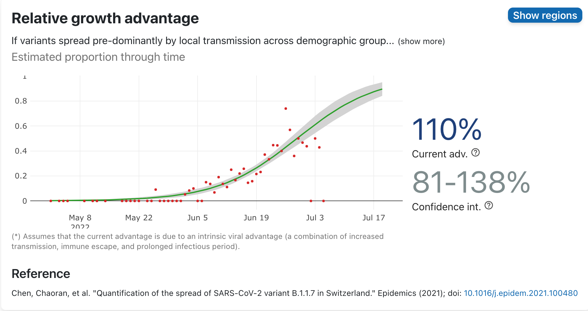

An up to date version of this graph can be found [here](https://cov-spectrum.org/explore/India/AllSamples/Past3M/variants?variantQuery=NextcladePangoLineage%3ABA.5*&variantQuery1=NextcladePangoLineage%3ABA.2.75&analysisMode=CompareToBaseline&)

### Selection of other interesting lineages

Many interesting BA.2 sublineages have appeared first in India. Here is a selection of some to watch. The mutations they carry are typical of BA.2 sublineages with (potential) growth advantages, in India and also globally.

#### BA.2.76 (S:R346T, S:Y248N)

<https://github.com/cov-lineages/pango-designation/issues/787>

<https://cov-spectrum.org/explore/World/AllSamples/Past3M/variants?pangoLineage=BA.2.76>

#### BA.2.38.1 (S:N417T, S:S247N, S:Y248S, S:K444N)

<https://github.com/cov-lineages/pango-designation/issues/809>

<https://cov-spectrum.org/explore/World/AllSamples/Past3M/variants?pangoLineage=BA.2.38.1>

#### BA.4.6 (S:346T)

<https://cov-spectrum.org/explore/World/AllSamples/Past6M/variants?aaMutations=S%3AR346T%2CN%3A151S%2CORF7b%3AL11F&nucMutations=12160A%2CC8140T>

## Latest developments

### South African pair of complex recombinant clusters

Two related clusters of complex Delta/BA.2 recombinants (C1 with 5 sequences and C2 with 4 sequences) have appeared in Gauteng/Limpopo (bordering region).
The Spikes are mostly identical, the rest of the genomes have multiple different breakpoints.

The Pango designation issue, with discussion about this lineage:
<https://github.com/cov-lineages/pango-designation/issues/844>

**Figure showing the recombination patterns for C1 and C2 across the genome**
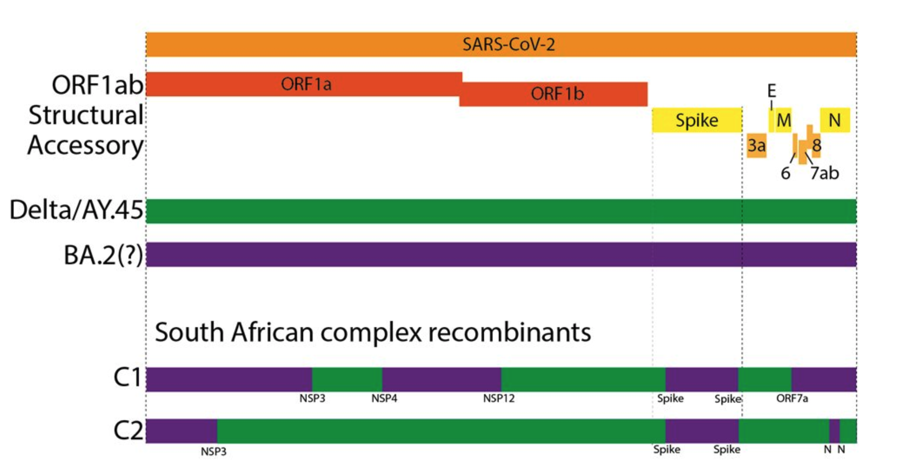
(Tom Peacock, private communication)

**Figure showing how mutations in C1 compare to other variants**
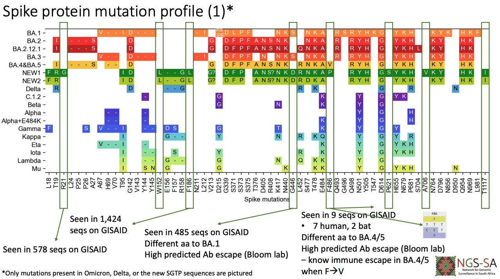

**Same figure but with different annotations**
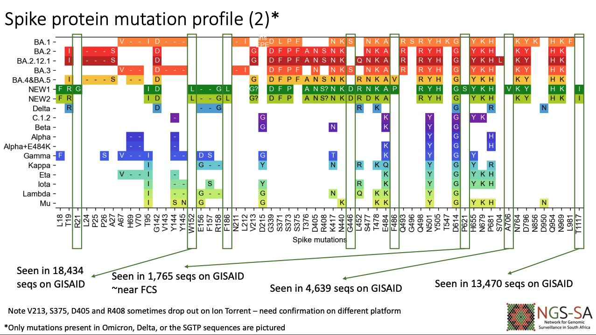
(from <https://www.nicd.ac.za/wp-content/uploads/2022/07/Update-of-SA-sequencing-data-from-GISAID-15-July-2022.pdf>)

### German BA.2/BA.1/BA.2 recombinant with convergence to BA.2.75

A BA.2/BA.1/BA.2 recombinant with many mutations of interest has appeared in Germany with 27 sequences to date and spread across Europe.

First sequence beginning of June.

Spike shows the following changes compared to BA.2:

- Missing: T19I, 24-26del, 27S not there because that part is from BA.1* parent
- Donated: 69-70del convergent with many VOCs
- Additional S:R346K, convergent with BA.1.1
- Additional S:K147E, S:N460K and reverted S:493 convergent with BA.2.75

<https://github.com/cov-lineages/pango-designation/issues/823>

## Trends

There seem to be two ways in which lineages evolve:

1. Stepwise accumulation of mutations with short branches
2. "Saltation" events, where clusters attach only on long branches.

In the past, all VOCs have appeared as saltation events.
Stepwise evolution does take place and is relevant for slow sweeps.
However all fast sweeps have been caused by saltation variants.
This is maybe not surprising as any variant comes out of nowhere and long branches are a result of fast growth.
It is thus not clear which way causality goes.
Shay Fleishon and his team in Israel are analyzing the daily updated Usher tree for new long branches allowing quick detection of potentially fast growing lineages.

Many saltations seem to derive from chronic infections as opposed to fast growing lineages so the ratio of false positives is high.

## Non-exhaustive list of BA.2 mutations to watch

This is a non-exhaustive list of mutations that are appearing repeatedly in lineages with growth advantage on top of BA.2\*:

- S:64R
- S:76
- S:152
- S:153
- S:157
- S:248N/S
- S:346T/S/I
- S:354K
- S:368I
- S:417T
- S:444N/T
- S:446S
- S:449D/S/N
- S:450D
- S:452Q/M
- S:460K
- S:468
- S:478T
