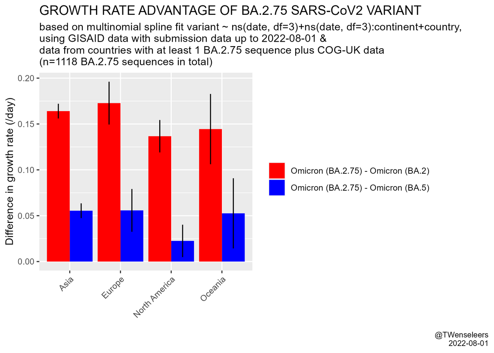

# Variant report 2022-08-03

## BA.2.75 outcompetes BA.5 in India

BA.5 continues to dominate in all countries with recent sequences apart from India/Nepal where BA.2.75 is becoming dominant.

As of 2022-08-03, there are around 1400 sequences of BA.2.75 on GISAID, almost 3 times as many as 14 days ago.

In India BA.2.75 has a large growth advantage over its ancestor BA.2 (16-17%/day) and a modest growth advantage over BA.5 (4-6%) as shown by [Tom Wenseleers](https://twitter.com/TWenseleers) using a hierarchical regression model that has performed well with past variants. For countries outside of India sequence numbers are still too small to distinguish conclusively between growth due to important and intrinsic growth advantage.

To put this into context, for BA.2.75 to grow from 0.1% to 50% in a background of BA.2 it would take around a month (this is approximately what is happening in India). In a background of BA.5, assuming growth advantages globally are the same as in India, it would take BA.2.75 about 3 months to grow from 0.1% of all sequences to 50%.

So while BA.2.75 seems to start driving a wave as visible in positivity rate attributed to variants, any potential BA.2.75 wave in e.g. Europe is still 2-3 months away and would be much less drastic than the wave caused by BA.1 vs Delta (~20% daily growth advantage), BA.2 vs BA.1 (~10% daily growth advantage) and BA.4/5 vs BA.2 (~10% daily growth advantage). Of course, it is possible that the BA.2.75 growth advantage vs BA.5 is India-specific and/or that another variant will evolve (either from BA.2, from BA.5, even BA.1 or non-Omicron) so that there will never be a BA.2.75 wavelet.

[Cov-Spectrum link with BA.2.75 in India](https://cov-spectrum.org/explore/India/AllSamples/Past3M/variants?variantQuery=NextcladePangoLineage%3ABA.2.75)

[Link to Twitter thread with figures](https://twitter.com/TWenseleers/status/1554189987586908161)

## Intra-Omicron recombinants keep appearing but so far with limited growth advantages

Recombinants containing BA.4/5-Spike have been identified recently but until now, no identifiable recombinants have become dominant at least regionally. It is possible that the various BA.1/2/3/4/5 involve recombination events but in these cases the parents are not clearly identifiable, separate lineages.

## BA.5 has small but definite growth advantage over BA.4

Despite BA.5 and BA.4 being very closely related, BA.5 has become dominant over the past few months. When BA.4 and BA.5 were first discovered, BA.4 was about 3 times more common than BA.5. This has now inverted, with BA.5 being 2-10x more common than BA.4, depending on the region. This translates to a daily growth advantage of about 1-3%.

## BA.4/5 sublineages with small to moderate growth advantages are appearing

A number of BA.4/5 sublineages that seem to show growth advantages compared to their parents have been identified.

BA.4.6 has an additional S:R346T (S:R346K was what conferred BA.1.1 a moderate growth advantage over BA.1) and seems to grow about 5%/day faster than BA.4. BA.4.6 is most common in North America (~3000 sequences as of 2022-08-03), making up around 20% of BA.4 in the US mid July, up from 1% mid May. Prevalence is around 1% in Europe in mid July.

Importantly, the growth advantage that BA.4.6 has over BA.4 (~5%/day) outweighs the growth disadvantage that BA.4 has against BA.5 (~1-3%/day), making BA.4.6 fitter than basic BA.5. BA.4.1.8, an independent BA.4 sublineage also has S:R346T and the concomitant growth advantage but has not been sequenced as often. It is most common in South Africa.

There are a number of BA.5 sublineages that have independently acquired mutations at S:346, e.g. BF.7 (=BA.5.2.1.7, S:346T) with ~600 sequences mostly from Belgium, BA.5.9 (S:346I) with ~600 sequences mostly from Germany.

Generally, BA.5.2.1 (aliased to BF for sublineages) seems to have a slight growth advantage over other BA.5 branches - despite not having any additional Spike mutations.

There are BA.4/5 sublineages with other Spike mutations, sometimes multiple Spike mutations, but the pattern is so far not as clear as for S:346 and all these lineages have not yet surpassed 1% even in the countries where they are most common.

## BA.2 with multiple spike mutations keep emerging

BA.2 sublineages with multiple Spike mutations keep emerging, mostly from India, but none of these seem to be able to compete with BA.5 and BA.2.75. In some cases the clusters are too small to be able to reliable say anything about the growth advantage.

To give some idea of the Spike profiles, here are a few interesting lineages:
- BA.2.10 + W64R, 141-144del, 243-244del, G446S, F486P, R493Q, S494P, P1143L [Pango issue #898](https://github.com/cov-lineages/pango-designation/issues/898)
- BA.2.38 (=S:417T)+ 69/70del, 71F, 452Q, 446S, 478R, 1264L [Pango issue #840](https://github.com/cov-lineages/pango-designation/issues/840)
- BA.2.38 (=S:417T)+ 157S, 444N [Pango issue #828](https://github.com/cov-lineages/pango-designation/issues/828)

# Variant report 2022-07-20

## Dominant variants

BA.5 is dominating waves on all continents, together with BA.4 which is slightly less fit than BA.5 but with identical Spike so very similar.

BA.2.12.1 still makes up a good share in North America but getting replaced by BA.4/5. It's also present with smaller share around the world where BA.4/5 also replaces it.

BA.2\* that is not BA.2.12.1 made up 1-10% around the world at the end of June, with the notable exception of India where BA.2\* makes still up ~90% (and countries without much sequencing for which these statements are not possible to be made).

BA.1 only appears occasionally, in sequences that often show signs of persistent/chronic infection.

## Variants to watch out for

India has never had significant BA.1 circulation. Many fit BA.2* lineages are present there.

### BA.2.75 (S:K147E,S:W152R,S:F157L,S:I210V,S:G257S,S:G339H,S:N460K,S:G446S)

BA.2.75 seems able to compete with BA.5 in India. It was introduced or emerged later than BA.5 (first sequence end of May) and its frequency seems to range between 10-50% depending on state at beginning of July.

BA.2.75 has 9 Spike amino acid substitutions relative to BA.2 (including reversion to wild type at 493) compared to the 3 substitutions (including reversion 493) plus one 2 AA deletion (S:69/70del) for BA.4/5, making BA.2.75 the most diverged Omicron variant with significant circulation to appear since BA.1/BA.2/BA.3.

BA.2.75 does appear to circulate globally, albeit at such low share that it is not possible to say much about growth advantage outside of India.
Countries with clusters of BA.2.75 include: UK, US, New Zealand, Japan, Indonesia, Germany, Israel.
Countries that are known to have exported cases are: Nepal/India (for many Japanese airport surveillance cases), France (for some Israeli cases)

<https://cov-spectrum.org/explore/World/AllSamples/Past3M/variants?variantQuery=NextcladePangoLineage%3ABA.2.75>

India has many states with different sampling practices so one needs to be cautious when interpreting aggregate growth advantages.

Nonetheless, the apparent growth advantage of BA.2.75 over BA.5\* at whole country aggregate level in India is compatible with a significant growth advantage. It is important to note that the statistical uncertainty does not account for systematic errors like biased sampling. The real uncertainty is much bigger than the range 81-138%.

An up to date version of this graph can be found [here](https://cov-spectrum.org/explore/India/AllSamples/Past3M/variants?variantQuery=NextcladePangoLineage%3ABA.5*&variantQuery1=NextcladePangoLineage%3ABA.2.75&analysisMode=CompareToBaseline&)

### Selection of other interesting lineages

Many interesting BA.2 sublineages have appeared first in India. Here is a selection of some to watch. The mutations they carry are typical of BA.2 sublineages with (potential) growth advantages, in India and also globally.

#### BA.2.76 (S:R346T, S:Y248N)

<https://github.com/cov-lineages/pango-designation/issues/787>

<https://cov-spectrum.org/explore/World/AllSamples/Past3M/variants?pangoLineage=BA.2.76>

#### BA.2.38.1 (S:N417T, S:S247N, S:Y248S, S:K444N)

<https://github.com/cov-lineages/pango-designation/issues/809>

<https://cov-spectrum.org/explore/World/AllSamples/Past3M/variants?pangoLineage=BA.2.38.1>

#### BA.4.6 (S:346T)

<https://cov-spectrum.org/explore/World/AllSamples/Past6M/variants?aaMutations=S%3AR346T%2CN%3A151S%2CORF7b%3AL11F&nucMutations=12160A%2CC8140T>

## Latest developments

### South African pair of complex recombinant clusters

Two related clusters of complex Delta/BA.2 recombinants (C1 with 5 sequences and C2 with 4 sequences) have appeared in Gauteng/Limpopo (bordering region).
The Spikes are mostly identical, the rest of the genomes have multiple different breakpoints.

The Pango designation issue, with discussion about this lineage:
<https://github.com/cov-lineages/pango-designation/issues/844>

**Figure showing the recombination patterns for C1 and C2 across the genome**

(Tom Peacock, private communication)

**Figure showing how mutations in C1 compare to other variants**

**Same figure but with different annotations**

(from <https://www.nicd.ac.za/wp-content/uploads/2022/07/Update-of-SA-sequencing-data-from-GISAID-15-July-2022.pdf>)

### German BA.2/BA.1/BA.2 recombinant with convergence to BA.2.75

A BA.2/BA.1/BA.2 recombinant with many mutations of interest has appeared in Germany with 27 sequences to date and spread across Europe.

First sequence beginning of June.

Spike shows the following changes compared to BA.2:

- Missing: T19I, 24-26del, 27S not there because that part is from BA.1* parent
- Donated: 69-70del convergent with many VOCs
- Additional S:R346K, convergent with BA.1.1
- Additional S:K147E, S:N460K and reverted S:493 convergent with BA.2.75

<https://github.com/cov-lineages/pango-designation/issues/823>

## Trends

There seem to be two ways in which lineages evolve:

1. Stepwise accumulation of mutations with short branches
2. "Saltation" events, where clusters attach only on long branches.

In the past, all VOCs have appeared as saltation events.
Stepwise evolution does take place and is relevant for slow sweeps.
However all fast sweeps have been caused by saltation variants.
This is maybe not surprising as any variant comes out of nowhere and long branches are a result of fast growth.
It is thus not clear which way causality goes.
Shay Fleishon and his team in Israel are analyzing the daily updated Usher tree for new long branches allowing quick detection of potentially fast growing lineages.

Many saltations seem to derive from chronic infections as opposed to fast growing lineages so the ratio of false positives is high.

## Non-exhaustive list of BA.2 mutations to watch

This is a non-exhaustive list of mutations that are appearing repeatedly in lineages with growth advantage on top of BA.2\*:

- S:64R
- S:76
- S:152
- S:153
- S:157
- S:248N/S
- S:346T/S/I
- S:354K
- S:368I
- S:417T
- S:444N/T
- S:446S
- S:449D/S/N
- S:450D
- S:452Q/M
- S:460K
- S:468
- S:478T
